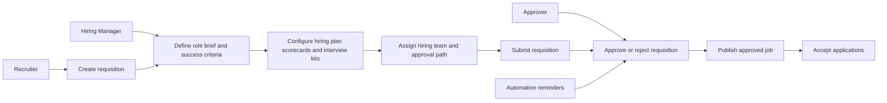
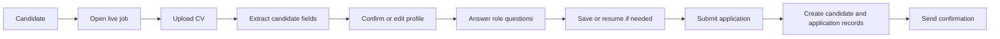
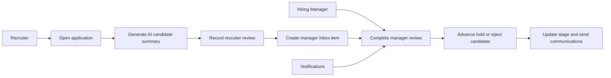
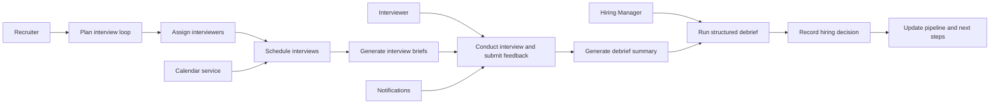
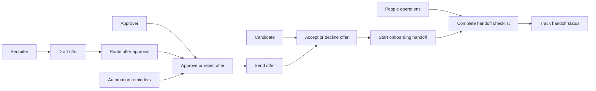
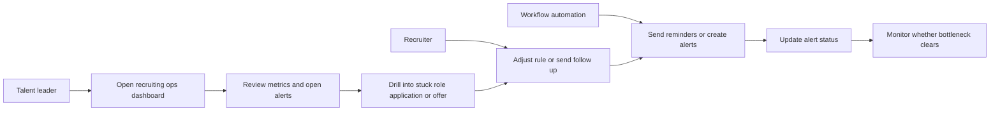
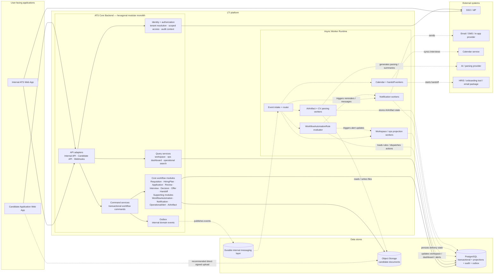

# LTI Design Package

## Context and assumptions

This document defines **LTI** as a **collaboration-first, automation-heavy, AI-assisted full-cycle Applicant Tracking System (ATS)** for **employer-side mid-market knowledge-work companies**.

### Extracted baseline product scope
From the uploaded project description, the baseline LTI scope covers the full hiring cycle, including:
- job creation,
- job publishing,
- application intake,
- review and screening,
- assessments,
- interview scheduling,
- hiring,
- and onboarding handoff.

This extracted scope is used as supporting product context, but it does **not** define the final product strategy, prioritization, or business model.

### Working assumptions
- Initial ICP: employer-side mid-market companies with roughly **100–1000 employees**
- Primary hiring context: **knowledge-work roles** with recruiter + hiring manager collaboration
- Initial go-to-market: **English-first**, likely US / international English-speaking customers first
- Product strategy: **best-of-breed recruiting system**, not a full HRIS/HCM suite and not a staffing-agency CRM
- AI strategy: **assistive, explainable, auditable, human-in-the-loop**, not fully autonomous hiring decisioning

---

## 1. Brief description of the LTI software, added value, and competitive advantages

### What LTI is
LTI is a **full-cycle ATS** designed to help mid-market hiring teams run a faster, more consistent, and more collaborative hiring process from requisition to onboarding handoff. The product is optimized not just for recruiters, but for the **entire hiring team**: recruiters, hiring managers, interviewers, coordinators, and talent leaders.

### Core value proposition
**LTI helps recruiters and hiring managers make faster, better hiring decisions by combining structured workflows, real-time collaboration, workflow automation, recruiting-operations intelligence, and trustworthy AI assistance.**

### Why this business model is attractive
The ATS market is crowded, but there is still strong replacement demand. Aptitude Research reports that **1 in 4 companies are replacing their ATS in 2025**, **82% say their current system has significant functionality gaps**, and only **22% believe their ATS alone can support true talent transformation**.[^aptitude]

This means a new entrant should not try to win as a generic ATS. It should win by solving a sharper problem better than incumbents. LTI's chosen wedge is:

> **Make hiring teams work better together, reduce manual coordination, and improve decision quality with structured workflows and practical AI.**

### Added value
LTI's added value comes from five sources:

1. **Better recruiter–manager alignment**  
   Shared hiring plans, role calibration, scorecards, interview kits, action tracking, and clearer decision ownership.

2. **Lower operational burden**  
   Automation reduces chasing, scheduling overhead, status management, and approval bottlenecks.

3. **Better hiring signal**  
   Candidate information is turned into structured evidence and decision-ready summaries instead of document overload.

4. **Better process visibility**  
   Real-time analytics show what is stuck, where candidates drop, and which stakeholders are slowing the funnel.

5. **Safer, more useful AI**  
   AI is used to summarize, draft, highlight, and recommend — not to make opaque final hiring decisions.

### Competitive advantages
LTI's most defensible competitive advantages should be:

#### 1) Collaboration-first design
Many ATS products support collaboration, but fewer make it the center of the product. LTI should be designed so hiring managers have a clear, low-friction operating experience instead of being occasional users forced into recruiter-centric workflows.

#### 2) Workflow automation across the full recruiter–manager loop
The product should automate not only candidate emails or isolated triggers, but the operational glue of hiring: reminders, approvals, escalations, interview coordination, and handoffs.[^workable]

#### 3) Recruiting operations intelligence as a core product layer
Analytics should not be a reporting afterthought. LTI should surface bottlenecks, feedback latency, stage conversion issues, and application friction in real time, following the direction validated by analytics-forward products like Ashby.[^ashby]

#### 4) Trustworthy AI assistance embedded in actual workflows
AI should accelerate the tasks teams already do — candidate summarization, interview prep, debrief synthesis, communication drafting, next-best-action recommendations — while preserving human judgment and auditability. This matters especially because employment-related AI use cases are treated as **high-risk** under the EU AI Act.[^ai-act]

#### 5) Signal-rich, low-friction candidate intake
LTI should reduce repetitive candidate effort and improve recruiter signal at the same time by extracting structured data from CVs, minimizing duplicate forms, supporting better alternatives to generic cover letters, and surfacing evidence-based summaries.

### Honest assessment
This strategy is attractive, but not easy.

LTI will compete against vendors that already cover parts of this story: Greenhouse on structured hiring, Ashby on analytics, Workable on practical automation, Teamtailor on candidate experience and collaboration, and others.[^greenhouse][^ashby][^workable]

Therefore, LTI will only win if the following are genuinely strong in the product:
- hiring-manager experience,
- workflow automation,
- real-time operational visibility,
- and practical AI usefulness.

If those are shallow, LTI risks becoming another mid-market ATS with familiar messaging and no compelling reason to switch.

---

## 2. Explanation of the main functions

The goal is **not** to build every ATS feature equally. The goal is to be excellent in the feature areas that directly support the strategic wedge.

### Main functionality set

#### A. Structured hiring workflow
**Why it matters:** This is the operating backbone of the product. Structured hiring is still one of the clearest sources of hiring quality improvement and recruiter–manager alignment.[^greenhouse]

**What it includes:**
- Requisition creation and approval
- Role brief and hiring plan
- Standardized pipeline stages
- Scorecard design
- Interview kits and interviewer guidance
- Decision framework and final hiring log

**Why it is a success driver:** Without this layer, LTI cannot credibly improve consistency or decision quality.

---

#### B. Hiring-manager collaboration workspace
**Why it matters:** In mid-market recruiting, many bottlenecks come from delayed manager reviews, incomplete feedback, unclear role alignment, and inconsistent interview participation.

**What it includes:**
- Shared recruiter–manager kickoff workspace
- Manager inbox for pending reviews, approvals, and feedback
- Candidate context view tailored to manager needs
- Debrief workspace with structured evidence
- Decision history by stakeholder and criterion
- SLA visibility for delayed actions

**Why it is a success driver:** This is the strongest differentiator. If LTI becomes the ATS that hiring managers actually like using, that creates real preference and retention power.

---

#### C. Workflow automation engine
**Why it matters:** Recruiters spend too much time coordinating people rather than making decisions. Automation is a direct efficiency lever.[^workable]

**What it includes:**
- Reminders for review, approval, and feedback deadlines
- Escalations for stalled actions
- Automated candidate communication by stage
- Interview scheduling flows and fallback rules
- Offer routing and approval flows
- Post-acceptance onboarding handoff triggers
- Duplicate candidate detection and merge support

**Why it is a success driver:** This functionality produces visible ROI quickly by reducing administrative work and time-to-hire.

---

#### D. Recruiting operations intelligence
**Why it matters:** Modern ATS buyers increasingly expect their recruiting platform to explain what is broken and how to improve it, not just store data.[^ashby]

**What it includes:**
- Time in stage by role and team
- Hiring-manager responsiveness
- Feedback completion rate and delay alerts
- Source-to-hire funnel analysis
- Stuck-role diagnostics
- Application drop-off and completion analytics
- Offer acceptance and late-stage leakage visibility

**Why it is a success driver:** This turns LTI from a workflow system into a decision-support system.

---

#### E. Trustworthy AI assistance layer
**Why it matters:** Recruiters face more volume and more noise. LinkedIn reports that applicants per open role in the US have doubled since spring 2022, while recruiters still struggle to find qualified talent efficiently.[^linkedin]

**What it includes:**
- CV and application summarization
- Structured evidence extraction from CV + answers + optional cover letter
- Candidate-to-role relevance summary
- Interview brief generation per interviewer
- Debrief summary generation
- Draft candidate communications
- Next-best-action recommendations
- Safe, structured candidate feedback drafting

**Why it is a success driver:** AI should reduce reading, writing, and coordination work without becoming a black-box gatekeeper.

**Guardrails:**
- No hidden ranking logic as the final decision basis
- No fully autonomous rejection logic
- No unsupported claims about candidate suitability
- Human review on sensitive actions
- Auditability for AI-generated suggestions

---

#### F. Signal-rich, low-friction candidate intake
**Why it matters:** Long and repetitive applications hurt candidate conversion and do not necessarily improve recruiter signal.

**What it includes:**
- CV upload with extract-first / confirm-second flow
- Autofill with explicit candidate confirmation
- Role-adaptive application requirements
- Optional structured motivation prompts instead of generic cover letters
- Candidate application save/resume flow
- Recruiter-facing evidence summary of candidate inputs

**Why it is a success driver:** It improves candidate experience and recruiter efficiency at the same time.

---

#### G. Offer and onboarding handoff
**Why it matters:** A weak end-of-funnel handoff reduces the perceived completeness of the ATS and creates re-entry work.

**What it includes:**
- Offer creation and approval
- Offer acceptance tracking
- Transition checklist to onboarding / HRIS handoff
- New-hire packet / data handoff workflow

**Why it is a success driver:** It reinforces the “full-cycle” promise of LTI and improves operational continuity.

### What should not be over-positioned as differentiation
LTI should still support these, but they are not the core wedge:
- job board publishing,
- careers page basics,
- standard integrations,
- generic email templates,
- standard reports and exports,
- basic parsing.

These are expected. They should work well, but they should not be the headline story.

---

## 3. Lean Canvas diagram

| Lean Canvas Block | LTI Definition |
|---|---|
| **Problem** | Mid-market hiring teams struggle with recruiter–manager misalignment, slow decisions, inconsistent evaluation, excessive manual coordination, weak operational visibility, and low-signal candidate artifacts. |
| **Customer Segments** | Primary: employer-side mid-market knowledge-work companies (100–1000 employees). Users: recruiters, hiring managers, interviewers, TA leaders, coordinators, HR operations. Buyers: Head of Talent, VP People, CHRO, HR Director. |
| **Unique Value Proposition** | **A collaboration-first, automation-heavy, AI-assisted full-cycle ATS that helps hiring teams make faster, better, more consistent decisions.** |
| **Solution** | Structured hiring workflow, manager collaboration workspace, automation engine, recruiting ops analytics, trustworthy AI assistance, signal-rich candidate intake, offer/onboarding handoff. |
| **Channels** | Founder-led sales, HR / TA communities, content marketing around structured hiring and recruiting ops, partnerships with recruiting consultants, targeted outbound to mid-market TA leaders, product-led demos. |
| **Revenue Streams** | Annual SaaS subscription by employee band or hiring volume; platform tiering by feature depth; optional premium modules for advanced analytics, AI assistance, and workflow automation. |
| **Cost Structure** | Product development, cloud hosting, AI inference and model costs, customer success/onboarding, integrations, sales, compliance and security investment. |
| **Key Metrics** | Time-to-hire, time-in-stage, manager response time, feedback completion rate, application completion rate, recruiter hours saved, offer acceptance rate, logo retention, expansion revenue. |
| **Unfair Advantage / Defensibility** | Better recruiter–manager UX, workflow-native intelligence, auditable AI assistance, operational analytics embedded into the ATS, and compounding workflow data that improves recommendations over time. |

### Lean Canvas interpretation
The business model is strongest when LTI is sold not as another place to manage applicants, but as:
- a **decision-quality improvement system**,
- a **recruiting workflow operating system**,
- and a **manager-adoption improvement layer** for hiring teams.

---

## 4. PRD (Product Requirements Document)

# PRD — LTI Collaboration-First Mid-Market ATS

## 4.1 Document purpose and objectives

This PRD defines the product requirements for **LTI**, a collaboration-first, automation-heavy, AI-assisted full-cycle ATS for employer-side mid-market knowledge-work companies.

This section is intended to serve two purposes:

1. **Team alignment and communication**  
   Provide a shared understanding for product, design, engineering, and go-to-market teams of what LTI is intended to do, for whom, and why.

2. **Structured implementation reference**  
   Provide a clear, bounded, explicit specification that can guide backlog creation, design decisions, engineering implementation, and AI-assisted development without turning the PRD into a system design document.

This PRD preserves the currently selected product direction and does **not** redefine LTI’s strategy, market, or major scope. It is a product-definition document, not an architecture or data-model specification. Companion references in later sections of the document may inform implementation, but they are outside the scope of this PRD revision.

---

## 4.2 Product overview

### 4.2.1 Product vision
LTI will become the operating system for mid-market hiring teams that need more structure, coordination, and operational intelligence than lightweight ATS tools provide, but without the heaviness of enterprise suites.

### 4.2.2 Problem statement
Mid-market knowledge-work companies often outgrow spreadsheets, email-heavy coordination, and lightweight ATS tooling, but still suffer from several persistent failures:
- hiring managers delay reviews and decisions,
- recruiters spend too much time coordinating people and process,
- candidate information is not converted into decision-ready signal,
- interview feedback is inconsistent or late,
- analytics are too limited to manage bottlenecks in real time,
- and candidate experience suffers from long or repetitive workflows.

Current ATS products often solve parts of this problem, but many teams still operate with fragmented decision-making, limited visibility, and too much manual effort.[^aptitude]

### 4.2.3 Product vision in operational terms
LTI is intended to improve how hiring teams work together, not merely where they store applicants. The product should:
- improve recruiter–manager alignment,
- reduce coordination overhead,
- structure hiring decisions,
- surface bottlenecks in real time,
- and use AI to accelerate work without removing human judgment.

### 4.2.4 Value proposition
For employer-side mid-market knowledge-work companies, LTI provides a full-cycle ATS that:
- improves recruiter–manager alignment,
- reduces coordination overhead,
- structures hiring decisions,
- surfaces bottlenecks in real time,
- and uses AI to accelerate work without removing human judgment.

---

## 4.3 Stakeholders and target users

### 4.3.1 Primary users
- Recruiters / talent acquisition specialists
- Hiring managers
- Talent acquisition leaders / Head of Talent
- Recruiting coordinators / People operations

### 4.3.2 Secondary users
- Interviewers
- HR / People leadership
- New-hire handoff stakeholders

### 4.3.3 Economic buyers
- Head of Talent
- VP People / People Director
- CHRO / HR Director
- Sometimes Finance or Operations for procurement approval

### 4.3.4 Internal delivery stakeholders
The PRD should support alignment across:
- Product management
- Product design
- Engineering
- QA / release management
- Customer success / implementation
- Sales / solutions teams, where needed for packaging and customer conversations

### 4.3.5 Stakeholder needs summary
- **Recruiters** need speed, structure, and reduced admin burden.
- **Hiring managers** need a simple, low-friction way to review, decide, and give feedback.
- **Interviewers** need clear interview guidance and easy feedback submission.
- **Talent leaders** need visibility into bottlenecks, responsiveness, and process quality.
- **Candidates** need low-friction applications and clear communication.
- **Economic buyers** need measurable value in speed, consistency, adoption, and workflow improvement.

---

## 4.4 Goals and objectives

### 4.4.1 Business goals
- Win the initial ICP with a differentiated ATS story
- Achieve credible replacement value versus incumbent ATS workflows
- Build a platform foundation for expansion into analytics, AI, and adjacent hiring workflow modules

### 4.4.2 Product goals
- Increase hiring manager participation and responsiveness
- Reduce recruiter administrative time
- Improve speed and consistency of candidate movement through the funnel
- Improve quality and usefulness of evaluation data
- Reduce candidate application friction while preserving hiring signal

### 4.4.3 Measurable goals
The following measurable goals are recommended for the first 12 months after initial production launch for the target ICP.

#### Adoption and engagement goals
- At least **70% of active hiring managers** in live customer accounts complete at least one review, approval, or feedback action each month.
- At least **80% of interview loops** in live customer accounts have complete structured feedback submitted before final debrief.
- At least **60% of recruiter users** actively use one or more automation rules each month.
- At least **50% of recruiter users** actively use at least one AI-assisted workflow each month.

#### Efficiency goals
- Reduce average **time-to-first-review** for shortlisted candidates by **30%** versus the customer’s baseline process.
- Reduce average **overdue manager review items** by **40%** versus baseline.
- Reduce average **time-in-stage** for core screening and interview stages by **20%** versus baseline.
- Reduce recruiter-reported administrative time per open role by at least **25%**.

#### Candidate experience goals
- Improve completed application rate for CV-based applications by **15%** versus customer baseline where redundant data entry is reduced.
- Keep candidate save-and-resume failure or abandonment caused by product-side issues below **1%** of started applications.

#### Business outcome goals
- Achieve customer gross retention of at least **90%** in the first renewal cycle.
- Achieve at least **25% attach rate** for advanced automation or AI features among live customers after initial rollout.

These targets should be refined during discovery and pilot phases, but they provide a measurable operating definition of success.

---

## 4.5 Scope, non-goals, and MVP boundaries

### 4.5.1 Product scope
LTI is defined as a **full-cycle ATS** for employer-side mid-market knowledge-work companies. Within the currently selected product direction, the core scope includes:
- requisition creation and approval,
- structured hiring plan and scorecards,
- job publication and candidate intake,
- recruiter and hiring-manager review,
- interview coordination and structured feedback,
- collaborative decision-making,
- offer workflow,
- and onboarding handoff basics.

### 4.5.2 Non-goals
LTI is **not** initially intended to be:
- a full HRIS/HCM platform,
- a staffing agency CRM,
- a frontline / hourly hiring specialist tool,
- an enterprise-global governance-heavy suite,
- or a fully autonomous AI screening and rejection system.

### 4.5.3 MVP scope
The MVP should focus on the parts of the product most central to the wedge.

#### In MVP
- Requisition and approval management
- Structured hiring plan and scorecards
- Hiring-manager collaboration workspace
- Candidate intake and structured candidate profile
- Basic AI summaries for candidate review and interview prep
- Core workflow automation (reminders, approvals, communications)
- Interview coordination and structured feedback
- Core real-time recruiting ops dashboard
- Offer workflow and onboarding handoff basics

#### Deliberately later
- Broad marketplace / ecosystem depth
- Extensive board syndication breadth
- Heavy compliance module depth by geography
- Advanced workforce planning connections
- Deep CRM / nurture campaigns
- Enterprise-grade multi-entity administration
- Advanced AI features that require greater governance complexity

### 4.5.4 Scope boundary notes
This PRD deliberately focuses on product-level behavior and boundaries. It does not define architecture, data schemas, infrastructure design, or detailed delivery plans.

---

## 4.6 Commercial model context

This subsection is included as product context because packaging and pricing assumptions influence feature prioritization and adoption design, especially around hiring-manager participation.

### 4.6.1 Business model summary

#### Packaging hypothesis
- **Core platform**: structured ATS workflow + collaboration + basic analytics
- **Pro tier**: advanced automation + advanced analytics + AI assistance
- **Enterprise / advanced tier later**: deeper controls, compliance features, advanced integrations, multi-entity administration

#### Pricing logic
Recommended starting model:
- annual SaaS subscription,
- priced by employee band or hiring volume,
- with generous / unlimited hiring-manager and interviewer access,
- premium pricing for advanced analytics, AI assistance, and automation depth.

#### Why this model fits
Mid-market buyers want value tied to hiring complexity and team usage, but penalizing manager participation through per-seat pricing can weaken adoption.

---

## 4.7 Product structure and main components

The following product structure organizes LTI into the main components needed for a first useful version and provides a practical reference for product, design, and engineering teams.

### 4.7.1 Main product components

1. **Requisition and hiring plan management**
   - requisition creation,
   - approvals,
   - role brief,
   - hiring plan,
   - scorecards,
   - interview structure

2. **Hiring-manager collaboration workspace**
   - manager inbox,
   - candidate review queue,
   - approvals,
   - feedback tasks,
   - debrief participation,
   - decision history

3. **Candidate intake and profile generation**
   - CV upload and parsing,
   - extract-first / confirm-second application flow,
   - role-specific questions,
   - structured candidate record

4. **Candidate review and signal extraction**
   - recruiter triage,
   - manager review,
   - evidence summaries,
   - strengths / gaps views,
   - candidate context for decision-making

5. **Interview coordination and structured feedback**
   - interview loop planning,
   - interviewer assignment,
   - scheduling support,
   - feedback collection,
   - debrief preparation

6. **Workflow automation**
   - reminders,
   - escalations,
   - communications,
   - approvals,
   - routing,
   - handoff triggers

7. **Recruiting operations intelligence**
   - time in stage,
   - bottleneck alerts,
   - responsiveness,
   - conversion metrics,
   - application friction and abandonment

8. **AI assistance**
   - candidate summaries,
   - interview briefs,
   - debrief summaries,
   - draft communications,
   - next-best-action recommendations,
   - safe feedback draft support

9. **Offer and onboarding handoff**
   - offer creation,
   - approvals,
   - acceptance tracking,
   - transition checklist,
   - HRIS / onboarding transfer package

### 4.7.2 Product structure principles
- The product should support the **full hiring loop**, but the main differentiation comes from collaboration, automation, intelligence, and practical AI.
- Components should work together as one operating workflow rather than as disconnected modules.
- Hiring-manager participation must be treated as a first-class product concern.

---

## 4.8 Core use cases

The PRD is centered on the following business-critical use cases:

1. Recruiter and hiring manager define a role and agree on success criteria
2. Recruiter opens a requisition and routes for approval
3. Job is published and applications begin arriving
4. Candidate CV is parsed; structured candidate profile is created
5. Recruiter triages candidates with AI summaries and role-linked evidence
6. Hiring manager reviews prioritized candidates in a task-oriented inbox
7. Interview plan and scorecards are assigned
8. Interviewers receive role-specific interview briefs and submit structured feedback
9. Recruiter and manager run a structured debrief and make a decision
10. Offer is generated, approved, and sent
11. Accepted candidate is handed off to onboarding / HR systems
12. TA leader monitors funnel bottlenecks, manager responsiveness, and conversion rates

These use cases represent the intended end-to-end product behavior at the PRD level. More formal implementation-oriented use-case modeling exists elsewhere in the document and is outside the editing scope of this section.

---

## 4.9 Main user stories

### Recruiter user stories
- As a recruiter, I want to create a requisition with a structured hiring plan so that the role is aligned before candidates enter the pipeline.
- As a recruiter, I want the system to remind managers and interviewers about pending actions so that I spend less time chasing people manually.
- As a recruiter, I want AI-generated candidate summaries tied to job requirements so that I can triage applications faster without losing important evidence.
- As a recruiter, I want a structured debrief workspace so that hiring decisions are easier to compare and document.
- As a recruiter, I want to automate stage-based communication and approval routing so that routine tasks do not slow down the funnel.

### Hiring manager user stories
- As a hiring manager, I want a simple inbox of pending candidate reviews and approvals so that I know exactly what requires my attention.
- As a hiring manager, I want to see concise candidate evidence rather than raw application overload so that I can make faster, more informed decisions.
- As a hiring manager, I want interview scorecards and evaluation criteria tied to the role so that my team evaluates consistently.
- As a hiring manager, I want to participate in a structured debrief with clear evidence so that final decisions are more confident and less subjective.

### Interviewer user stories
- As an interviewer, I want role-specific interview guidance and a simple feedback form so that I know what to assess and can submit useful feedback quickly.

### Talent leader user stories
- As a talent leader, I want real-time visibility into stuck roles, response delays, and stage conversion so that I can fix process problems before they impact hiring outcomes.
- As a talent leader, I want to understand whether automation and AI features are improving speed and consistency so that I can justify continued investment.

### Candidate user stories
- As a candidate, I want the system to extract information from my CV and only ask me to confirm or complete missing fields so that I do not retype what is already present.
- As a candidate, I want application requirements to feel relevant to the role so that the process feels fair and not unnecessarily repetitive.
- As a candidate, I want timely, clear communication throughout the process so that I understand my status and next steps.

---

## 4.10 Functional requirements

### FR-1 Requisition and hiring plan management
The system shall allow recruiters and managers to create a requisition, define role requirements, assign an approval flow, and configure the hiring plan.

**Key capabilities**
- Job requisition creation
- Approval routing
- Role brief and hiring goals
- Interview plan template selection
- Hiring team assignment

### FR-2 Structured hiring configuration
The system shall support creation of scorecards, evaluation rubrics, and interview kits tied to role requirements.[^greenhouse]

**Key capabilities**
- Scorecard templates
- Required competencies and evaluation criteria
- Stage-specific interview kits
- Role-specific interviewer guidance

### FR-3 Hiring-manager collaboration workspace
The system shall provide a dedicated collaboration interface for hiring managers.

**Key capabilities**
- Manager task inbox
- Candidate review queue
- Feedback due indicators
- Approval actions
- Debrief participation view
- Decision history and rationale view

### FR-4 Candidate intake and profile generation
The system shall ingest candidate applications and produce structured candidate records.

**Key capabilities**
- CV upload and parsing
- Candidate confirmation of extracted fields
- Role-adaptive application flows
- Candidate duplicate detection
- Candidate profile history

### FR-5 Candidate signal extraction
The system shall convert submitted candidate artifacts into structured recruiter- and manager-friendly summaries.

**Key capabilities**
- Candidate evidence summary
- Requirement-to-evidence mapping
- Key strengths / gaps view
- Optional structured motivation prompts
- Optional cover-letter summarization

### FR-6 Workflow automation
The system shall support configurable workflow automations across the hiring process.[^workable]

**Key capabilities**
- Reminder triggers
- Escalation triggers
- Communication triggers
- Approval routing triggers
- Offer routing automation
- Handoff automation

### FR-7 Interview coordination and feedback collection
The system shall support interview planning, scheduling support, and structured feedback submission.

**Key capabilities**
- Interview loop planning
- Candidate scheduling support
- Interviewer assignment
- Feedback due reminders
- Structured feedback forms
- Debrief preparation package

### FR-8 Real-time recruiting ops analytics
The system shall provide real-time operational reporting and alerts.[^ashby]

**Key capabilities**
- Funnel conversion dashboard
- Time-in-stage reporting
- Stuck-role alerts
- Hiring-manager responsiveness view
- Feedback completion dashboard
- Application abandonment and completion analytics

### FR-9 AI assistance
The system shall provide assistive AI features embedded into recruiter and manager workflows.

**Key capabilities**
- Candidate summarization
- Relevance explanation draft
- Interview brief generation
- Debrief summary generation
- Candidate message drafting
- Next-best-action recommendations
- Safe feedback draft suggestions

**AI guardrails**
- Human review on sensitive communications
- Auditability of generated content
- Explanation of input basis where appropriate
- No unreviewed, high-stakes autonomous decisioning

### FR-10 Offer and onboarding handoff
The system shall manage offer workflow and downstream handoff.

**Key capabilities**
- Offer draft and approval
- Candidate response tracking
- Handoff checklist
- Basic HRIS / onboarding transfer package

---

## 4.11 UX and usability considerations

The UX should directly reinforce the product strategy. LTI should not simply expose ATS objects; it should help each user complete the most important hiring actions quickly and consistently.

### 4.11.1 Recruiter UX
- Prioritize speed, throughput, and reduced administrative effort.
- Minimize repetitive clicks for common tasks such as triage, reminders, scheduling, and status updates.
- Surface pending actions, stalled workflows, and candidate context in one working view.

### 4.11.2 Hiring-manager UX
- Optimize for infrequent but high-impact usage.
- Present a simple task-oriented inbox rather than a complex recruiter-centric interface.
- Show concise, decision-ready candidate evidence rather than raw application overload.
- Make approvals, reviews, and debrief participation clear and low friction.

### 4.11.3 Interviewer UX
- Keep interview guidance lightweight and role-specific.
- Make feedback submission fast, structured, and deadline-aware.

### 4.11.4 Candidate UX
- Minimize redundant data entry through extract-first / confirm-second flows.
- Support save-and-resume for longer applications.
- Ensure role-specific questions feel relevant and proportional to the application purpose.
- Provide clear confirmation and status communication.

### 4.11.5 Cross-cutting UX principles
- Prefer explicit workflow state over ambiguity.
- Make accountability visible without creating unnecessary noise.
- Clearly distinguish AI-generated assistance from human-entered content.
- Reduce document overload by surfacing structured evidence and summaries.

---

## 4.12 Non-functional requirements and technical constraints

These are product-level requirements, not implementation design.

### 4.12.1 Security and privacy
- Role-based access control
- Audit logging for sensitive actions
- Protection of candidate PII
- Configurable retention and deletion policies

### 4.12.2 Reliability
- Core workflow actions should be dependable and recoverable
- Candidate application submission should be robust and not fail silently

### 4.12.3 Usability
- Recruiter flows must reduce clicks for repetitive operations
- Hiring-manager experience must be simple enough for infrequent users
- Candidate application experience must minimize redundant work

### 4.12.4 Explainability and governance
- AI-assisted outputs must be clearly marked as AI-generated or AI-assisted where appropriate
- Sensitive AI usage must allow human review and correction
- Product behavior should support customer governance requirements in hiring workflows[^ai-act]

### 4.12.5 Reporting integrity
- Operational analytics should reflect current workflow state with trustworthy, reconcilable data

### 4.12.6 Interoperability and integration constraints
- The product must support practical integration with key workflow systems such as calendar, email, and downstream HR handoff systems.
- Integration requirements should be defined at the workflow level in product terms before implementation design begins.
- External integrations must not become a prerequisite for core in-product workflow completion in the MVP where avoidable.

### 4.12.7 Technical requirements at PRD level
- The product must support auditable workflow events for approvals, feedback, decisions, and AI-assisted outputs.
- The product must preserve traceability from candidate inputs and role requirements to generated summaries and decisions where relevant.
- Configuration should be preferred over engineering-dependent customization for workflow rules that are intended for customer operations teams.
- Product behavior must remain compatible with human-in-the-loop AI governance and customer review requirements.

---

## 4.13 Acceptance criteria

These acceptance criteria are written at the product-feature level so they can guide later story breakdown.

### AC-1 Structured hiring workflow
- A recruiter can create a requisition, assign a hiring manager, and configure a hiring plan without leaving the main workflow.
- A hiring manager can review and approve a requisition with visible role requirements and interview plan context.
- Scorecards and interview kits can be attached to a role before candidates are advanced to interview stages.

### AC-2 Hiring-manager collaboration workspace
- A hiring manager sees all pending candidate reviews, feedback tasks, and approvals in a single task-oriented view.
- The workspace clearly shows overdue actions and required next steps.
- Recruiters and managers can access a shared decision log tied to explicit evaluation criteria.

### AC-3 Workflow automation
- Admins or recruiters can configure reminders, escalations, and communication triggers without engineering support.
- Automated reminders are sent when configured deadlines are missed.
- Offer and handoff workflows can trigger downstream tasks after candidate acceptance.

### AC-4 Candidate intake and signal extraction
- A candidate can upload a CV and receive extracted fields for confirmation instead of re-entering all information manually.
- Recruiters can view a structured candidate summary with evidence linked to job requirements.
- The system can support role-specific application questions without forcing the same flow for every role.

### AC-5 Interview coordination and feedback
- Recruiters can assign interviewers and collect structured feedback for each stage.
- Interviewers receive role-specific context before interviews.
- Debrief preparation includes consolidated feedback and candidate evidence.

### AC-6 Recruiting ops analytics
- Recruiters and talent leaders can view current time-in-stage, overdue feedback, and manager responsiveness in-product.
- Roles that exceed configurable delay thresholds are surfaced as stuck or at risk.
- Application completion and abandonment data is visible for each role.

### AC-7 AI assistance
- AI summaries are clearly labeled and presented as assistive output, not final decisions.
- Users can review and edit AI-generated drafts before sending or saving sensitive outputs.
- AI-generated content is traceable to the relevant candidate inputs, role requirements, or workflow context.

### AC-8 Offer and onboarding handoff
- Recruiters can generate and route offers for approval in-product.
- Accepted candidates can be moved into a defined onboarding handoff workflow without re-entering core information.

---

## 4.14 Prioritization

### 4.14.1 P0 — must-have to support positioning
- Structured hiring workflow
- Hiring-manager workspace
- Workflow automation basics
- Candidate intake + profile generation
- Interview feedback collection
- Core recruiting ops analytics

### 4.14.2 P1 — strong differentiators
- AI candidate summaries
- AI interview briefs
- AI debrief summaries
- Application friction analytics
- Decision logs and accountability signals
- Safe candidate feedback drafting

### 4.14.3 P2 — later expansion
- Advanced AI recommendations
- Extended integrations ecosystem
- Advanced benchmarking
- Broader CRM / talent pooling capabilities
- Verticalized templates by industry

### 4.14.4 Prioritization guidance
Prioritization should continue to favor the features that most strongly reinforce:
- recruiter–manager collaboration,
- reduced manual coordination,
- structured hiring decisions,
- operational visibility,
- and practical, governable AI assistance.

---

## 4.15 Success metrics / KPIs

### 4.15.1 Product usage metrics
- Hiring-manager weekly active usage
- Feedback completion rate
- Average time to review shortlisted candidates
- Automation utilization rate
- AI assistance utilization rate

### 4.15.2 Outcome metrics
- Time-to-hire
- Time-in-stage reduction
- Candidate application completion rate
- Offer acceptance rate
- Recruiter time saved per role
- Reduction in overdue approvals / feedback

### 4.15.3 Business metrics
- Logo acquisition in target ICP
- Time-to-first-live-role after purchase
- Gross retention and net retention
- Expansion into advanced analytics / AI tiers
- Win rate versus incumbent ATS alternatives

### 4.15.4 Metric interpretation notes
- Product usage metrics should be read together with workflow quality metrics, not in isolation.
- AI usage alone is not success; the important measure is whether AI improves speed, clarity, and consistency without degrading trust.
- Candidate experience metrics should be evaluated with signal quality, not just completion volume.

---

## 4.16 Assumptions, dependencies, risks, and open questions

### 4.16.1 Assumptions
- Mid-market buyers value manager adoption and workflow quality enough to switch ATS
- Recruiter pain is operational enough that automation and analytics will resonate strongly
- Candidate-signal improvement matters more than simply collecting more text or more applicants

### 4.16.2 Dependencies
- A strong initial UX for recruiters and hiring managers
- Reliable integrations with calendars, email, and downstream HR handoff systems
- Careful AI governance and messaging

### 4.16.3 Risks
1. **Crowded market risk**  
   The ATS category is competitive; weak differentiation will be punished quickly.

2. **Execution risk on collaboration UX**  
   If the manager experience is clumsy, the strategic wedge weakens significantly.

3. **AI overreach risk**  
   If AI is positioned as autonomous or opaque, trust and compliance concerns can outweigh its value.[^ai-act]

4. **Scope creep risk**  
   Trying to serve SMB simplicity, enterprise governance, staffing workflows, and high-volume hiring simultaneously will weaken the product.

5. **Data quality risk**  
   Recruiting analytics and AI usefulness depend on disciplined workflow capture.

### 4.16.4 Open questions for the next iteration
- Should LTI begin with one functional-industry focus inside knowledge-work (e.g., B2B SaaS / tech-enabled services)?
- How much configurability should the initial workflow engine expose versus guided defaults?
- Which candidate-facing feedback features should be enabled by default versus optional?
- What is the best pricing packaging for encouraging hiring-manager participation without reducing revenue potential?
- Which integrations are truly required for first-wave adoption versus nice-to-have?

---

## 4.17 Supporting notes

### 4.17.1 Relationship to later sections
Later sections of the document contain more implementation-oriented companion references, including formalized use cases and a logical data model. Those sections are intentionally outside the scope of this PRD revision and should be treated as supporting references rather than replacements for the product requirements defined here.

### 4.17.2 PRD usage guidance
This PRD should be used to:
- align stakeholders on product intent and scope,
- derive epics, stories, and acceptance tests,
- guide UX and workflow design,
- bound implementation decisions,
- and support AI-assisted development with explicit functional and non-functional expectations.

### 4.17.3 Deliberate exclusions from this PRD
This section does **not** define:
- system architecture,
- detailed technical design,
- database schema,
- delivery dates,
- sprint plans,
- or staffing plans.

---

## 4.18 Final recommendation summary
LTI should move forward as a **collaboration-first, automation-heavy, AI-assisted full-cycle ATS for employer-side mid-market knowledge-work companies**.

This direction is recommended because it best fits the existing LTI product scope, targets a segment with real pain and real willingness to pay, and allows meaningful differentiation beyond generic ATS or generic AI positioning. The product should win not by trying to be everything to everyone, but by being visibly better at:
- recruiter–manager collaboration,
- workflow automation,
- recruiting operations intelligence,
- and trustworthy AI assistance.

---

## 5. MVP-aligned use cases and Mermaid diagrams

### 5.1 Assumptions

- Section 4 is the canonical product definition. This section groups the PRD’s required MVP behavior into the minimum end-to-end use-case set needed to satisfy that scope.
- Job publication is included at the level needed to publish an approved requisition and receive applications. Broad board syndication depth remains outside the MVP.
- AI assistance in the MVP is limited to labeled, reviewable, auditable outputs such as candidate summaries, interview briefs, debrief summaries, and draft communications. AI does not make autonomous hiring decisions.
- Workflow automation in the MVP is limited to reminders, escalations, approval routing, stage-based communications, and post-acceptance handoff triggers. This section does not assume a full low-code workflow platform.
- Real-time recruiting ops visibility is modeled as an in-product operational dashboard over current workflow state and active alerts, not as a separate analytics warehouse product.
- Onboarding handoff basics end at transfer package preparation, checklist tracking, and handoff status. Downstream HRIS onboarding execution remains out of scope.
- The use cases below are grouped by business outcome, not by individual feature bullet. This keeps the set lean while still covering the full MVP.

### 5.2 MVP-aligned top use cases

#### Use Case 1 — Create, approve, and publish a structured requisition

- **Purpose:** Establish the role, align recruiter and hiring manager on success criteria, configure the structured hiring framework, and make the role publishable.
- **Primary actor(s):** Recruiter
- **Supporting actor(s):** Hiring Manager, Approver(s), Notification Service
- **Preconditions:**
  - The organization and internal users already exist.
  - The recruiter has permission to create requisitions.
  - The hiring manager is identified.
- **Main flow:**
  1. Recruiter creates a new requisition and captures the business need, title, headcount, department, location, and employment details.
  2. Recruiter and hiring manager define the role brief, success criteria, and required evaluation criteria.
  3. Recruiter configures the hiring plan, pipeline stages, scorecards, and interview kits.
  4. Recruiter assigns the hiring team and approval path.
  5. Recruiter submits the requisition for approval.
  6. The system creates approval records and due dates.
  7. Approvers review and approve or reject the requisition.
  8. The system sends reminders or escalations for overdue approvals.
  9. When approved, the recruiter publishes the job posting.
- **Dependencies:**
  - User and permission management
  - Job posting capability
  - Workflow automation for approval reminders and escalations
- **Postconditions:**
  - An approved requisition exists.
  - The structured hiring plan, scorecards, interview kits, and team assignments are in place.
  - A published job posting is available to accept applications.
  - The approval trail is recorded.
- **Why it is required for the MVP:** This use case covers requisition and approval management, structured hiring plan setup, scorecards, interview structure, and the first automation loop. Without it, the rest of the MVP lacks role context and decision structure.

#### Use Case 2 — Submit an application and create a structured candidate profile

- **Purpose:** Let a candidate apply with low friction while producing a structured candidate and application record for downstream review.
- **Primary actor(s):** Candidate
- **Supporting actor(s):** Notification Service
- **Preconditions:**
  - A live job posting exists.
  - The application flow for the posting is configured.
- **Main flow:**
  1. Candidate opens the live job posting.
  2. Candidate uploads a CV or resume.
  3. The system extracts candidate fields from the uploaded document.
  4. Candidate confirms or edits the extracted information.
  5. Candidate answers role-specific application questions.
  6. Candidate can save and resume before final submission.
  7. Candidate submits the application.
  8. The system creates or merges the candidate record, stores submitted documents, and creates an application at the initial stage.
  9. The system sends submission confirmation and records start, save, submit, and abandonment signals needed for application-friction visibility.
- **Dependencies:**
  - Published job posting
  - CV parsing and extraction
  - Duplicate-candidate detection
  - Candidate confirmation and communication flow
- **Postconditions:**
  - A structured candidate record exists.
  - A role-linked application exists.
  - Candidate documents and application responses are stored.
  - The application is placed into the initial workflow stage.
  - Candidate confirmation is sent.
- **Why it is required for the MVP:** This use case covers candidate intake, structured candidate profile creation, low-friction application flow, save/resume basics, and the data needed for later application-completion analytics.

#### Use Case 3 — Review candidates in the recruiter and hiring-manager workspace

- **Purpose:** Support recruiter triage and hiring-manager collaboration using structured evidence, AI summaries, and task-oriented review workflows.
- **Primary actor(s):** Recruiter
- **Supporting actor(s):** Hiring Manager, Notification Service
- **Preconditions:**
  - A submitted application exists.
  - The requisition has an active hiring plan, criteria, and workflow stages.
- **Main flow:**
  1. Recruiter opens the candidate application.
  2. The system presents an AI-assisted candidate summary and requirement-linked evidence view.
  3. Recruiter records a structured review and initial recommendation.
  4. If hiring-manager review is required, the system creates a manager inbox item with a due date.
  5. The system sends reminders for overdue manager action.
  6. Hiring manager reviews the candidate in a task-oriented workspace and records a recommendation or rationale.
  7. Recruiter advances, holds, or rejects the candidate based on the current evaluation state.
  8. The system updates stage state, preserves the review trail, and sends configured internal or candidate-facing communications.
- **Dependencies:**
  - Candidate profile and application data
  - AI summary generation and traceability
  - Review workflow records and notifications
- **Postconditions:**
  - Structured recruiter and manager review records exist.
  - The hiring-manager collaboration trail is visible.
  - The candidate’s current stage is updated.
  - Related communications and audit signals are recorded.
- **Why it is required for the MVP:** This use case is the core hiring-manager workspace workflow. It directly supports recruiter–manager collaboration, basic AI candidate summaries, manager responsiveness, and workflow automation for pending actions.

#### Use Case 4 — Coordinate interviews, collect structured feedback, and record a decision

- **Purpose:** Move a progressed candidate through interviews, structured feedback, debrief, and final documented decision-making.
- **Primary actor(s):** Recruiter
- **Supporting actor(s):** Hiring Manager, Interviewer, Calendar Service, Notification Service
- **Preconditions:**
  - The candidate has been advanced to an interview stage.
  - Interview kits, criteria, and interviewers can be assigned.
- **Main flow:**
  1. Recruiter plans the interview loop for the application.
  2. Recruiter assigns interviewers and relevant interview kits.
  3. The system schedules interviews or stores interview scheduling state.
  4. The system generates AI-assisted interview briefs using role and candidate context.
  5. Interviewers conduct interviews and submit structured feedback against the relevant criteria.
  6. The system sends reminders for overdue feedback and flags missing submissions.
  7. The system prepares debrief inputs, including consolidated feedback and an AI-assisted debrief summary.
  8. Recruiter and hiring manager run a structured debrief.
  9. The team records the hiring decision with explicit rationale.
  10. The system updates the candidate pipeline and sends the appropriate next-step communication.
- **Dependencies:**
  - Interview stage configuration
  - Interview kits and evaluation criteria
  - Calendar and notification support
  - AI interview-brief and debrief-support capability
- **Postconditions:**
  - Interview records and interviewer assignments exist.
  - Structured feedback is stored.
  - A documented hiring decision exists.
  - Pipeline state and related communications are updated.
- **Why it is required for the MVP:** This use case covers interview coordination, structured feedback, collaborative debriefing, final decision capture, and the second major AI-assisted workflow in the MVP.

#### Use Case 5 — Generate, approve, and resolve an offer; initiate onboarding handoff

- **Purpose:** Convert a hire decision into an approved offer, track the candidate response, and launch onboarding handoff basics without re-entering core data.
- **Primary actor(s):** Recruiter
- **Supporting actor(s):** Approver(s), Candidate, People Operations or Handoff Stakeholder, Notification Service
- **Preconditions:**
  - A hire decision exists for the application.
  - Offer approval rules and permissions are defined.
- **Main flow:**
  1. Recruiter drafts an offer using application and requisition context.
  2. Recruiter routes the offer for approval.
  3. The system tracks approval steps and sends reminders or escalations for overdue approvals.
  4. Once approved, the recruiter sends the offer to the candidate.
  5. Candidate accepts or declines the offer.
  6. If accepted, the system creates the onboarding handoff record and transfer package.
  7. The system creates checklist items for the handoff stakeholders.
  8. Handoff stakeholders acknowledge or complete the required items.
  9. The system records the offer outcome and current handoff status.
- **Dependencies:**
  - Prior hiring decision
  - Offer approval routing
  - Candidate communication flow
  - Handoff configuration
- **Postconditions:**
  - The offer lifecycle and approval trail are stored.
  - Candidate response is tracked.
  - Onboarding handoff basics are initiated and visible.
- **Why it is required for the MVP:** Offer workflow and onboarding handoff basics are explicitly inside the MVP in section 4. Leaving them out would preserve the old, narrower interpretation and keep sections 5 and 6 misaligned.

#### Use Case 6 — Monitor recruiting operations and act on bottlenecks

- **Purpose:** Give recruiters and talent leaders real-time visibility into funnel health, overdue actions, and stalled workflows, and let them intervene quickly.
- **Primary actor(s):** Talent Acquisition Leader
- **Supporting actor(s):** Recruiter, Hiring Manager, Notification Service
- **Preconditions:**
  - Requisitions, applications, reviews, interviews, feedback, offers, and handoff states are being captured in-product.
  - Workflow timestamps and due dates are available.
- **Main flow:**
  1. Talent Acquisition Leader opens the recruiting ops dashboard.
  2. The system shows current time in stage, overdue approvals, overdue reviews, overdue feedback, manager responsiveness, application completion and abandonment, offer status, and open alerts.
  3. The user drills into a stuck requisition, application, interview loop, or offer.
  4. The user triggers a follow-up action or adjusts the relevant workflow rule.
  5. The system sends reminders, escalations, or communications, and updates alert status.
  6. The user monitors whether the bottleneck clears.
- **Dependencies:**
  - Stage transitions and lifecycle timestamps
  - Workflow automation rules
  - Alerts and notifications
  - Current operational data from core workflow entities
- **Postconditions:**
  - Operational state is visible in-product.
  - Interventions and alert updates are recorded.
  - Teams can act on stuck workflows before they become larger process failures.
- **Why it is required for the MVP:** Core real-time recruiting ops visibility is explicitly inside the MVP. This use case is required to support the product wedge around operational intelligence and manager responsiveness.

### 5.3 Validation notes

This use-case set is sufficient for the MVP in section 4 because it covers the full required workflow without fragmenting the model into one use case per feature.

- **Use Case 1** covers role definition, requisition approval, structured hiring-plan setup, scorecards, interview structure, and job publication.
- **Use Case 2** covers candidate intake, CV extraction, structured candidate profile creation, role-specific application data, and application-friction signals.
- **Use Case 3** covers recruiter triage, hiring-manager review, manager inbox behavior, AI candidate summaries, and automation for pending actions.
- **Use Case 4** covers interview coordination, interviewer guidance, structured feedback, debrief preparation, and documented hiring decisions.
- **Use Case 5** covers offer creation, approval, response tracking, and onboarding handoff basics.
- **Use Case 6** covers the core real-time recruiting ops dashboard, bottleneck detection, and corrective action.

Together, these six use cases cover the PRD’s intended end-to-end MVP behavior from requisition through handoff and ops visibility.

The section intentionally does **not** add separate use cases for:
- broad job-board ecosystem depth,
- deep CRM or nurture campaigns,
- enterprise multi-entity administration,
- full HRIS onboarding execution,
- advanced AI recommendations,
- or governance-heavy compliance modules.

Those areas remain later or outside the MVP boundary.

## 6. Logical data model for the MVP-aligned LTI scope

This section defines the **logical data model** for the **MVP-aligned LTI scope** based on the use cases in section 5.

Unlike the prior narrower version, this model explicitly supports:
- requisition and approval,
- structured hiring plan and scorecards,
- candidate intake and structured candidate profile,
- recruiter and hiring-manager review,
- interview coordination and structured feedback,
- core workflow automation,
- core real-time recruiting ops visibility,
- offer workflow,
- and onboarding handoff basics.

### 6.1 Assumptions and modeling boundary

#### Scope included
The model includes the business data needed for:
- requisition creation, approval, and publication,
- structured hiring-plan configuration,
- scorecards, interview kits, and stage configuration,
- low-friction candidate intake and structured candidate profile creation,
- recruiter and hiring-manager review,
- interview coordination, scheduling state, and structured feedback,
- collaborative decision logging,
- configurable workflow automation for reminders, escalations, communications, and handoff triggers,
- operational alerts and dashboard-relevant timestamps,
- offer creation, approval, and response tracking,
- and onboarding handoff basics.

#### Scope intentionally excluded
The model does **not** attempt to define:
- a full HRIS or onboarding execution model,
- deep CRM or nurture workflows,
- broad marketplace or board-syndication depth,
- enterprise multi-entity administration,
- advanced benchmarking or warehouse-style analytics facts,
- deep compensation planning or payroll modeling,
- or autonomous AI decisioning.

#### Modeling assumptions
- A **structured candidate profile** is modeled as the combined logical view of `Candidate`, `CandidateDocument`, `Application`, `ApplicationResponse`, and relevant `AIArtifact` records. It is not introduced as a separate denormalized entity.
- The **hiring-manager workspace** is modeled as a derived task view over pending approvals, candidate reviews, interview feedback, offer approvals, and handoff items. It does not require a separate inbox entity in the MVP.
- The **recruiting ops dashboard** is modeled primarily from transactional workflow data and lifecycle timestamps, with `OperationalAlert` used to persist exceptions that require attention. A dedicated analytics mart is intentionally not modeled in the MVP.
- `Notification`, `OperationalAlert`, `AIArtifact`, and `WorkflowAutomationRule` use logical context fields such as `related_entity_type` and `related_entity_id` or `scope_type` and `scope_entity_id` to stay lean. Physical implementation may realize those links differently.
- External integrations such as calendar, email, and downstream HRIS handoff are represented by workflow-level references and status fields, not by full external-system schemas.
- AI artifacts are always assistive and reviewable. They are never treated as autonomous final hiring decisions.

---

### 6.2 Entity inventory

#### Core entities

| Entity | Purpose |
|---|---|
| Organization | Tenant root for ATS data ownership |
| User | Internal actor such as recruiter, hiring manager, interviewer, coordinator, or talent leader |
| Requisition | Internal hiring request for a role |
| RequisitionApproval | Approval step in the requisition workflow |
| HiringPlan | Structured role brief, success profile, and hiring configuration |
| PipelineStage | Ordered hiring workflow stages and stage-level SLA target |
| EvaluationCriterion | Scorecard or rubric criterion used in evaluation |
| InterviewKit | Stage-specific interview guidance and prompts |
| JobPosting | Candidate-facing published representation of the requisition |
| Candidate | Master candidate profile for the organization |
| CandidateDocument | Resume, cover letter, or related candidate file |
| Application | Candidate submission to a specific requisition or posting |
| ApplicationQuestion | Role-specific application prompt |
| CandidateReview | Recruiter or hiring-manager review of an application |
| Interview | Planned or scheduled interview event for an application |
| InterviewFeedback | Structured post-interview evaluation record |
| HiringDecision | Final documented candidate decision |
| Offer | Offer record and lifecycle |
| OfferApproval | Approval step in the offer workflow |
| OnboardingHandoff | Accepted-candidate handoff record to downstream onboarding stakeholders |

#### Supporting entities

| Entity | Purpose |
|---|---|
| WorkflowAutomationRule | Configurable rule for reminders, escalations, communications, approval routing, and handoff triggers |
| Notification | Internal or candidate-facing reminder, request, or status communication |
| OperationalAlert | Persisted operational exception such as overdue review or stage delay |
| AIArtifact | Traceable AI-generated or AI-assisted output used in review, interview prep, debrief, or draft communication |

#### Associative / junction entities

| Entity | Purpose |
|---|---|
| RequisitionTeamMember | Assigns users to requisition-specific team roles |
| ApplicationResponse | Stores a candidate’s answer to a posting-specific application question |
| ApplicationStageTransition | Tracks application movement through the pipeline over time |
| InterviewParticipant | Assigns users to specific interviews |
| FeedbackCriterionRating | Criterion-level score and evidence inside interview feedback |
| DecisionParticipant | Records stakeholder participation in the final debrief or decision |
| DecisionCriterionAssessment | Records final criterion-level decision rationale |
| OnboardingHandoffItem | Checklist or task item within the onboarding handoff |

---

### 6.3 Detailed logical data model

#### Modeling conventions

- All identifiers are `uuid`.
- `enum` means a controlled vocabulary, not necessarily a separate lookup table.
- `json` is used only where flexible structured payloads are helpful in the MVP.
- Standard audit fields such as `created_at` and `updated_at` are assumed on mutable entities unless more specific lifecycle timestamps are listed explicitly.
- Foreign-key notes below are logical references. Physical implementation can vary.

---

#### Entity: Organization

- **Purpose:** Tenant root for ATS ownership and scope.
- **Primary key:** `organization_id (uuid)`

| Attribute | Type | Description | Notes |
|---|---|---|---|
| organization_id | uuid | Unique organization identifier | PK |
| name | string | Organization name | Unique within platform |
| status | enum | Tenant status | e.g. active, inactive |
| default_timezone | string | Default time zone | Optional |
| default_locale | string | Default locale | Optional |

**Important relationships:** One organization owns many users, requisitions, candidates, workflow automation rules, notifications, operational alerts, and AI artifacts.

---

#### Entity: User

- **Purpose:** Internal actor participating in hiring workflows.
- **Primary key:** `user_id (uuid)`

| Attribute | Type | Description | Notes |
|---|---|---|---|
| user_id | uuid | Unique user identifier | PK |
| organization_id | uuid | Owning organization | FK -> Organization |
| email | string | User email address | Unique within organization |
| first_name | string | First name |  |
| last_name | string | Last name |  |
| display_name | string | Display name |  |
| user_type | enum | Primary system persona | recruiter, hiring_manager, interviewer, coordinator, talent_leader, admin |
| status | enum | Access status | invited, active, inactive |

**Important relationships:** Users can own requisitions, approve requisitions and offers, review candidates, coordinate interviews, submit feedback, record decisions, own alerts, and complete handoff items.

---

#### Entity: Requisition

- **Purpose:** Internal hiring request that anchors the role workflow.
- **Primary key:** `requisition_id (uuid)`

| Attribute | Type | Description | Notes |
|---|---|---|---|
| requisition_id | uuid | Unique requisition identifier | PK |
| organization_id | uuid | Owning organization | FK -> Organization |
| recruiter_owner_user_id | uuid | Recruiter accountable for the role | FK -> User |
| hiring_manager_user_id | uuid | Hiring manager for the role | FK -> User |
| requisition_code | string | Human-readable requisition reference | Unique within organization |
| title | string | Role title |  |
| department_name | string | Business unit or team | Kept as attribute in MVP |
| location_text | string | Hiring location | Free text in MVP |
| employment_type | enum | Employment relationship | e.g. full_time, contract |
| workplace_type | enum | Work arrangement | e.g. remote, hybrid, onsite |
| headcount | integer | Number of openings | Default 1 |
| business_need_text | text | Business reason for opening the role |  |
| status | enum | Requisition lifecycle | draft, pending_approval, approved, published, closed, cancelled |
| target_start_date | date | Desired candidate start date | Optional |
| published_at | datetime | First publish timestamp | Optional |
| closed_at | datetime | Closure timestamp | Optional |

**Important relationships:** A requisition has many approval steps, one active hiring plan, many team members, one or more job postings, many applications, and may be the logical scope for workflow rules or operational alerts.

---

#### Entity: RequisitionApproval

- **Purpose:** Approval step in the requisition approval path.
- **Primary key:** `requisition_approval_id (uuid)`

| Attribute | Type | Description | Notes |
|---|---|---|---|
| requisition_approval_id | uuid | Unique approval-step identifier | PK |
| requisition_id | uuid | Related requisition | FK -> Requisition |
| approver_user_id | uuid | Assigned approver | FK -> User |
| step_order | integer | Sequence in the approval flow | Supports serial or ordered routing |
| status | enum | Approval state | pending, approved, rejected, skipped |
| due_at | datetime | Due timestamp | Supports reminders and SLA visibility |
| decided_at | datetime | Decision timestamp | Optional |
| comments | text | Approver rationale or note | Optional |

**Important relationships:** Many approval steps belong to one requisition. Pending steps also act as actionable items in the manager or approver workspace.

---

#### Entity: HiringPlan

- **Purpose:** Structured role brief and evaluation framework for a requisition.
- **Primary key:** `hiring_plan_id (uuid)`

| Attribute | Type | Description | Notes |
|---|---|---|---|
| hiring_plan_id | uuid | Unique hiring-plan identifier | PK |
| requisition_id | uuid | Parent requisition | FK -> Requisition |
| role_summary | text | Summary of the role |  |
| success_profile_text | text | What success looks like in the role |  |
| must_have_requirements_json | json | Required qualifications or capabilities | Structured list |
| nice_to_have_requirements_json | json | Preferred qualifications | Structured list |
| status | enum | Plan state | draft, active, archived |
| version_number | integer | Revision number | Optional but useful for change tracking |

**Important relationships:** One active hiring plan belongs to a requisition and owns the pipeline stages and evaluation criteria used downstream.

---

#### Entity: PipelineStage

- **Purpose:** Ordered stage in the hiring workflow.
- **Primary key:** `stage_id (uuid)`

| Attribute | Type | Description | Notes |
|---|---|---|---|
| stage_id | uuid | Unique stage identifier | PK |
| hiring_plan_id | uuid | Parent hiring plan | FK -> HiringPlan |
| stage_name | string | Stage label |  |
| stage_type | enum | Functional stage category | e.g. intake, recruiter_review, manager_review, interview, decision, offer, hired, rejected |
| sequence_number | integer | Stage order |  |
| target_sla_hours | integer | Target maximum duration for the stage | Supports stuck-stage visibility |
| is_terminal | boolean | Terminal-stage indicator |  |
| is_active | boolean | Active-stage indicator |  |

**Important relationships:** A hiring plan contains many stages. Applications reference one current stage, and stage transitions record movement between stages. Interviews occur within interview stages.

---

#### Entity: EvaluationCriterion

- **Purpose:** Scorecard criterion used in reviews, interviews, and final decision-making.
- **Primary key:** `criterion_id (uuid)`

| Attribute | Type | Description | Notes |
|---|---|---|---|
| criterion_id | uuid | Unique criterion identifier | PK |
| hiring_plan_id | uuid | Parent hiring plan | FK -> HiringPlan |
| stage_id | uuid | Optional stage-specific scope | Nullable FK -> PipelineStage |
| name | string | Criterion name |  |
| description | text | Guidance on what to assess | Optional |
| criterion_type | enum | Criterion category | e.g. competency, experience, behavior, domain, knockout |
| rating_scale_json | json | Allowed ratings or scale metadata | Optional |
| is_required | boolean | Whether the criterion must be evaluated |  |
| display_order | integer | Display order |  |

**Important relationships:** Criteria belong to the hiring plan, may be stage-scoped, and are used in both interview feedback and final decision-by-criterion assessment.

---

#### Entity: InterviewKit

- **Purpose:** Stage-specific interviewer guidance and prompts.
- **Primary key:** `interview_kit_id (uuid)`

| Attribute | Type | Description | Notes |
|---|---|---|---|
| interview_kit_id | uuid | Unique interview-kit identifier | PK |
| stage_id | uuid | Related interview stage | FK -> PipelineStage |
| title | string | Kit title |  |
| guidance_text | text | Interview guidance |  |
| prompts_json | json | Suggested questions or focus prompts | Optional |
| status | enum | Kit state | draft, active, archived |

**Important relationships:** A pipeline stage may have one or more interview kits. Interviews may reference the applicable kit for interviewer context.

---

#### Entity: RequisitionTeamMember

- **Purpose:** Assignment of a user to a requisition-specific team role.
- **Primary key:** `requisition_team_member_id (uuid)`

| Attribute | Type | Description | Notes |
|---|---|---|---|
| requisition_team_member_id | uuid | Unique team-assignment identifier | PK |
| requisition_id | uuid | Related requisition | FK -> Requisition |
| user_id | uuid | Assigned user | FK -> User |
| team_role | enum | Role on the hiring team | recruiter_owner, recruiter_collaborator, hiring_manager, interviewer, approver, coordinator |
| responsibility_text | text | Optional responsibility note | Optional |
| is_active | boolean | Whether the assignment is active |  |

**Important relationships:** Resolves many-to-many assignment between requisitions and users.

---

#### Entity: JobPosting

- **Purpose:** Candidate-facing published representation of the requisition.
- **Primary key:** `job_posting_id (uuid)`

| Attribute | Type | Description | Notes |
|---|---|---|---|
| job_posting_id | uuid | Unique posting identifier | PK |
| requisition_id | uuid | Source requisition | FK -> Requisition |
| title | string | Public title |  |
| public_description | text | Candidate-facing job description |  |
| visibility | enum | Posting visibility | external, internal, both |
| posting_status | enum | Posting lifecycle | draft, live, paused, closed |
| application_open_at | datetime | Opening timestamp | Optional |
| application_close_at | datetime | Closing timestamp | Optional |
| public_url | string | Candidate-facing posting URL | Optional |

**Important relationships:** A requisition may have one or more postings. A posting owns role-specific application questions and can receive many applications.

---

#### Entity: Candidate

- **Purpose:** Master candidate profile within the organization.
- **Primary key:** `candidate_id (uuid)`

| Attribute | Type | Description | Notes |
|---|---|---|---|
| candidate_id | uuid | Unique candidate identifier | PK |
| organization_id | uuid | Owning organization | FK -> Organization |
| first_name | string | First name |  |
| last_name | string | Last name |  |
| primary_email | string | Main email address | Optional |
| phone | string | Phone number | Optional |
| location_text | string | Current location | Optional |
| linkedin_url | string | Professional profile URL | Optional |
| consent_status | enum | Data-consent status | provided, withdrawn, not_required |
| profile_status | enum | Candidate master status | active, duplicate, withdrawn, archived |
| merged_into_candidate_id | uuid | Surviving candidate after merge | Nullable self-FK |

**Important relationships:** A candidate owns documents and may have many applications across roles. Duplicate handling is modeled through self-reference instead of a separate master-data module.

---

#### Entity: CandidateDocument

- **Purpose:** Resume, cover letter, or related candidate file.
- **Primary key:** `candidate_document_id (uuid)`

| Attribute | Type | Description | Notes |
|---|---|---|---|
| candidate_document_id | uuid | Unique document identifier | PK |
| candidate_id | uuid | Owning candidate | FK -> Candidate |
| document_type | enum | Document category | resume, cover_letter, attachment, portfolio |
| file_name | string | Original file name |  |
| file_ref | string | Logical storage reference |  |
| parsed_text | text | Extracted raw text | Optional |
| extraction_json | json | Structured extracted fields | Optional |
| is_primary | boolean | Primary document indicator |  |
| uploaded_at | datetime | Upload timestamp |  |

**Important relationships:** Candidate documents feed structured profile creation and AI-assisted summaries.

---

#### Entity: Application

- **Purpose:** Candidate submission to a specific requisition or posting.
- **Primary key:** `application_id (uuid)`

| Attribute | Type | Description | Notes |
|---|---|---|---|
| application_id | uuid | Unique application identifier | PK |
| candidate_id | uuid | Applicant candidate | FK -> Candidate |
| requisition_id | uuid | Target requisition | FK -> Requisition |
| job_posting_id | uuid | Source posting | Nullable FK -> JobPosting |
| current_stage_id | uuid | Current workflow stage | Nullable FK -> PipelineStage |
| source_type | enum | Source attribution | careers_site, referral, recruiter_sourced, import, internal |
| status | enum | Application lifecycle | draft, submitted, in_review, interviewing, offer, hired, rejected, withdrawn |
| started_at | datetime | When the candidate started applying | Supports abandonment analysis |
| last_saved_at | datetime | Last save-resume timestamp | Optional |
| submitted_at | datetime | Submission timestamp | Optional |
| abandoned_at | datetime | Abandonment timestamp | Optional |
| last_activity_at | datetime | Most recent workflow activity | Optional |
| save_resume_token | string | Resume-token reference | Optional |
| withdrawn_at | datetime | Withdrawal timestamp | Optional |
| rejected_at | datetime | Rejection timestamp | Optional |

**Important relationships:** This is the central operational entity linking candidate, requisition, posting, stage progression, reviews, interviews, decision, offer, and later handoff.

---

#### Entity: ApplicationQuestion

- **Purpose:** Role-specific application prompt shown on the posting.
- **Primary key:** `application_question_id (uuid)`

| Attribute | Type | Description | Notes |
|---|---|---|---|
| application_question_id | uuid | Unique question identifier | PK |
| job_posting_id | uuid | Related posting | FK -> JobPosting |
| question_text | text | Candidate-facing prompt |  |
| question_type | enum | Input type | short_text, long_text, single_select, multi_select, boolean, number, date, file |
| is_required | boolean | Required indicator |  |
| display_order | integer | Display order |  |
| options_json | json | Response options or configuration | Optional |

**Important relationships:** One job posting may have many role-specific questions. Questions are answered through `ApplicationResponse`.

---

#### Entity: ApplicationResponse

- **Purpose:** Candidate answer to one posting-specific application question.
- **Primary key:** `application_response_id (uuid)`

| Attribute | Type | Description | Notes |
|---|---|---|---|
| application_response_id | uuid | Unique response identifier | PK |
| application_id | uuid | Related application | FK -> Application |
| application_question_id | uuid | Related question | FK -> ApplicationQuestion |
| response_text | text | Free-text response | Optional |
| response_json | json | Structured response payload | Optional |
| created_at | datetime | Capture timestamp |  |

**Important relationships:** Resolves the role-specific response set for an application.

---

#### Entity: CandidateReview

- **Purpose:** Structured recruiter or hiring-manager review of an application.
- **Primary key:** `candidate_review_id (uuid)`

| Attribute | Type | Description | Notes |
|---|---|---|---|
| candidate_review_id | uuid | Unique review identifier | PK |
| application_id | uuid | Reviewed application | FK -> Application |
| reviewer_user_id | uuid | Reviewing user | FK -> User |
| review_type | enum | Review actor type | recruiter_review, manager_review |
| status | enum | Review state | pending, completed, skipped |
| recommendation | enum | Review recommendation | advance, hold, reject, request_interview, request_more_info |
| summary_text | text | Review summary or rationale | Optional |
| ai_artifact_id | uuid | Linked AI summary used in the review | Nullable FK -> AIArtifact |
| due_at | datetime | Due timestamp | Supports responsiveness tracking |
| completed_at | datetime | Completion timestamp | Optional |

**Important relationships:** Candidate reviews support recruiter triage and hiring-manager workspace behavior. Pending reviews function as task items for the manager inbox.

---

#### Entity: ApplicationStageTransition

- **Purpose:** History of application movement through the pipeline.
- **Primary key:** `stage_transition_id (uuid)`

| Attribute | Type | Description | Notes |
|---|---|---|---|
| stage_transition_id | uuid | Unique transition identifier | PK |
| application_id | uuid | Related application | FK -> Application |
| from_stage_id | uuid | Previous stage | Nullable FK -> PipelineStage |
| to_stage_id | uuid | New stage | FK -> PipelineStage |
| changed_by_user_id | uuid | Actor who changed the stage | Nullable FK -> User |
| transition_reason | text | Reason for the transition | Optional |
| entered_at | datetime | Stage-entry timestamp |  |
| exited_at | datetime | Stage-exit timestamp | Optional |
| is_current | boolean | Whether this is the active stage row |  |

**Important relationships:** Stage transitions power time-in-stage reporting, stuck-stage detection, and workflow traceability.

---

#### Entity: Interview

- **Purpose:** Planned or scheduled interview event for an application.
- **Primary key:** `interview_id (uuid)`

| Attribute | Type | Description | Notes |
|---|---|---|---|
| interview_id | uuid | Unique interview identifier | PK |
| application_id | uuid | Related application | FK -> Application |
| stage_id | uuid | Interview stage | FK -> PipelineStage |
| interview_kit_id | uuid | Guidance kit used | Nullable FK -> InterviewKit |
| brief_ai_artifact_id | uuid | Primary AI interview brief | Nullable FK -> AIArtifact |
| interview_type | enum | Interview format | phone, video, onsite, panel, case, work_sample |
| schedule_status | enum | Scheduling state | planned, scheduling, scheduled, completed, cancelled |
| scheduled_start_at | datetime | Scheduled start | Optional |
| scheduled_end_at | datetime | Scheduled end | Optional |
| location_text | string | Meeting room or link | Optional |
| calendar_event_ref | string | External calendar reference | Optional |
| coordinator_user_id | uuid | Coordinating user | Nullable FK -> User |

**Important relationships:** An application can have many interviews. Interviews have participants, collect feedback, and may store a selected AI interview brief.

---

#### Entity: InterviewParticipant

- **Purpose:** Assignment of a user to a specific interview.
- **Primary key:** `interview_participant_id (uuid)`

| Attribute | Type | Description | Notes |
|---|---|---|---|
| interview_participant_id | uuid | Unique participation identifier | PK |
| interview_id | uuid | Related interview | FK -> Interview |
| user_id | uuid | Assigned user | FK -> User |
| participant_role | enum | Interview role | interviewer, observer, coordinator, note_taker |
| attendance_status | enum | Invitation or attendance state | invited, accepted, declined, completed, no_show |
| assigned_at | datetime | Assignment timestamp |  |

**Important relationships:** Resolves many-to-many assignment between interviews and users.

---

#### Entity: InterviewFeedback

- **Purpose:** Structured post-interview evaluation record.
- **Primary key:** `interview_feedback_id (uuid)`

| Attribute | Type | Description | Notes |
|---|---|---|---|
| interview_feedback_id | uuid | Unique feedback identifier | PK |
| interview_id | uuid | Related interview | FK -> Interview |
| submitted_by_user_id | uuid | Feedback author | FK -> User |
| feedback_status | enum | Feedback state | pending, submitted, waived, late |
| overall_recommendation | enum | Overall interview recommendation | strong_yes, yes, mixed, no, strong_no |
| strengths_text | text | Strengths summary | Optional |
| concerns_text | text | Concerns summary | Optional |
| overall_notes_text | text | Additional notes | Optional |
| due_at | datetime | Due timestamp | Supports feedback-completion tracking |
| submitted_at | datetime | Submission timestamp | Optional |

**Important relationships:** Interview feedback provides structured evaluation input for debrief and decision-making. Pending feedback records also act as interviewer tasks.

---

#### Entity: FeedbackCriterionRating

- **Purpose:** Criterion-level score and evidence inside one interview feedback record.
- **Primary key:** `feedback_rating_id (uuid)`

| Attribute | Type | Description | Notes |
|---|---|---|---|
| feedback_rating_id | uuid | Unique rating identifier | PK |
| interview_feedback_id | uuid | Parent feedback record | FK -> InterviewFeedback |
| criterion_id | uuid | Rated evaluation criterion | FK -> EvaluationCriterion |
| rating_value | decimal | Numeric score where applicable | Optional |
| rating_label | string | Human-readable score label | Optional |
| evidence_text | text | Supporting evidence | Optional |

**Important relationships:** Resolves the many-to-many relationship between interview feedback and evaluation criteria.

---

#### Entity: HiringDecision

- **Purpose:** Final documented candidate decision.
- **Primary key:** `hiring_decision_id (uuid)`

| Attribute | Type | Description | Notes |
|---|---|---|---|
| hiring_decision_id | uuid | Unique decision identifier | PK |
| application_id | uuid | Related application | FK -> Application |
| decision_stage_id | uuid | Stage where decision was recorded | Nullable FK -> PipelineStage |
| decision_type | enum | Decision outcome | hire, reject, hold, no_hire |
| outcome_status | enum | Record status | proposed, confirmed, reversed |
| rationale_text | text | Final rationale |  |
| decided_at | datetime | Decision timestamp |  |
| decided_by_user_id | uuid | User who recorded the decision | FK -> User |
| ai_artifact_id | uuid | Linked debrief summary or assistive AI output | Nullable FK -> AIArtifact |

**Important relationships:** A hiring decision belongs to one application, may summarize criterion-level outcome, may include multiple participants, and may authorize one or more offer versions.

---

#### Entity: DecisionParticipant

- **Purpose:** Stakeholder participation record for the final debrief or decision.
- **Primary key:** `decision_participant_id (uuid)`

| Attribute | Type | Description | Notes |
|---|---|---|---|
| decision_participant_id | uuid | Unique participant record identifier | PK |
| hiring_decision_id | uuid | Parent decision | FK -> HiringDecision |
| user_id | uuid | Participating stakeholder | FK -> User |
| participant_role | enum | Role in the decision process | recruiter, hiring_manager, interviewer |
| recommendation | enum | Individual recommendation | hire, no_hire, hold, abstain |
| rationale_text | text | Participant rationale | Optional |
| recorded_at | datetime | Recorded timestamp |  |

**Important relationships:** Resolves many-to-many between decisions and stakeholders.

---

#### Entity: DecisionCriterionAssessment

- **Purpose:** Final criterion-level synthesis recorded with the hiring decision.
- **Primary key:** `decision_criterion_assessment_id (uuid)`

| Attribute | Type | Description | Notes |
|---|---|---|---|
| decision_criterion_assessment_id | uuid | Unique assessment identifier | PK |
| hiring_decision_id | uuid | Parent decision | FK -> HiringDecision |
| criterion_id | uuid | Evaluated criterion | FK -> EvaluationCriterion |
| rating_value | decimal | Final normalized score | Optional |
| rating_label | string | Final human-readable rating | Optional |
| rationale_text | text | Criterion-specific decision rationale | Optional |

**Important relationships:** Supports the shared decision log tied to explicit criteria.

---

#### Entity: Offer

- **Purpose:** Offer record and lifecycle for a candidate application.
- **Primary key:** `offer_id (uuid)`

| Attribute | Type | Description | Notes |
|---|---|---|---|
| offer_id | uuid | Unique offer identifier | PK |
| application_id | uuid | Related application | FK -> Application |
| hiring_decision_id | uuid | Decision authorizing the offer | FK -> HiringDecision |
| created_by_user_id | uuid | User who drafted the offer | FK -> User |
| offer_version | integer | Offer revision number | Supports revised offers |
| status | enum | Offer lifecycle | draft, pending_approval, approved, sent, accepted, declined, withdrawn, expired |
| compensation_summary_json | json | Core compensation and package summary | Logical only, not payroll depth |
| offer_terms_text | text | Human-readable offer terms | Optional |
| proposed_start_date | date | Proposed start date | Optional |
| expiration_at | datetime | Offer expiration | Optional |
| sent_at | datetime | Sent timestamp | Optional |
| responded_at | datetime | Response timestamp | Optional |
| accepted_at | datetime | Acceptance timestamp | Optional |
| declined_at | datetime | Decline timestamp | Optional |

**Important relationships:** An application may have one or more offer versions. Each offer can have approval steps and may start onboarding handoff after acceptance.

---

#### Entity: OfferApproval

- **Purpose:** Approval step in the offer workflow.
- **Primary key:** `offer_approval_id (uuid)`

| Attribute | Type | Description | Notes |
|---|---|---|---|
| offer_approval_id | uuid | Unique offer-approval identifier | PK |
| offer_id | uuid | Parent offer | FK -> Offer |
| approver_user_id | uuid | Assigned approver | FK -> User |
| step_order | integer | Approval sequence |  |
| status | enum | Approval state | pending, approved, rejected, skipped |
| due_at | datetime | Due timestamp | Supports offer-routing reminders |
| decided_at | datetime | Decision timestamp | Optional |
| comments | text | Approver note | Optional |

**Important relationships:** Many approval steps may belong to one offer. Pending steps act as task items for approvers.

---

#### Entity: OnboardingHandoff

- **Purpose:** Accepted-candidate handoff record to downstream onboarding stakeholders or systems.
- **Primary key:** `handoff_id (uuid)`

| Attribute | Type | Description | Notes |
|---|---|---|---|
| handoff_id | uuid | Unique handoff identifier | PK |
| offer_id | uuid | Accepted offer that triggered the handoff | FK -> Offer |
| initiated_by_user_id | uuid | User who started the handoff | FK -> User |
| target_system | enum | Downstream destination type | none, hris, onboarding_tool, email_package |
| status | enum | Handoff lifecycle | pending, in_progress, sent, acknowledged, completed, failed |
| handoff_package_json | json | Core transfer payload metadata | Basic MVP transfer package |
| initiated_at | datetime | Handoff-start timestamp |  |
| completed_at | datetime | Completion timestamp | Optional |
| notes | text | Additional handoff note | Optional |

**Important relationships:** An accepted offer may initiate one or more handoff attempts. The handoff owns checklist items used to complete or acknowledge transfer readiness.

---

#### Entity: OnboardingHandoffItem

- **Purpose:** Checklist or task item within the onboarding handoff.
- **Primary key:** `handoff_item_id (uuid)`

| Attribute | Type | Description | Notes |
|---|---|---|---|
| handoff_item_id | uuid | Unique handoff-item identifier | PK |
| handoff_id | uuid | Parent handoff | FK -> OnboardingHandoff |
| item_name | string | Checklist item name |  |
| item_type | enum | Item category | data_transfer, document, task, checklist |
| assignee_user_id | uuid | Assigned stakeholder | Nullable FK -> User |
| status | enum | Item state | pending, completed, skipped, failed |
| due_at | datetime | Due timestamp | Optional |
| completed_at | datetime | Completion timestamp | Optional |

**Important relationships:** Handoff items provide the minimal checklist/task model needed for onboarding handoff basics.

---

#### Entity: WorkflowAutomationRule

- **Purpose:** Configurable rule for reminders, escalations, communications, approval routing, and handoff triggers.
- **Primary key:** `workflow_rule_id (uuid)`

| Attribute | Type | Description | Notes |
|---|---|---|---|
| workflow_rule_id | uuid | Unique automation-rule identifier | PK |
| organization_id | uuid | Owning organization | FK -> Organization |
| name | string | Rule name |  |
| scope_type | enum | Rule scope level | organization, requisition, posting |
| scope_entity_id | uuid | Scoped entity identifier | Optional logical reference |
| trigger_type | enum | Event that evaluates the rule | due_date_missed, stage_changed, status_changed, offer_accepted |
| condition_json | json | Rule condition payload | Thresholds, filters, or routing conditions |
| action_type | enum | Action to perform | send_reminder, send_candidate_message, escalate, create_alert, route_approval, start_handoff |
| template_key | string | Optional message or action preset | Optional |
| is_active | boolean | Whether the rule is enabled |  |

**Important relationships:** A rule belongs to one organization and may generate notifications or operational alerts.

---

#### Entity: Notification

- **Purpose:** Internal or candidate-facing reminder, request, or status communication.
- **Primary key:** `notification_id (uuid)`

| Attribute | Type | Description | Notes |
|---|---|---|---|
| notification_id | uuid | Unique notification identifier | PK |
| organization_id | uuid | Owning organization | FK -> Organization |
| workflow_rule_id | uuid | Rule that triggered the notification | Nullable FK -> WorkflowAutomationRule |
| recipient_type | enum | Recipient class | user, candidate |
| recipient_user_id | uuid | Internal recipient | Nullable FK -> User |
| recipient_candidate_id | uuid | Candidate recipient | Nullable FK -> Candidate |
| related_entity_type | enum | Workflow object category | requisition, application, review, interview, offer, handoff |
| related_entity_id | uuid | Workflow object identifier | Logical context reference |
| notification_type | enum | Communication purpose | reminder, review_request, status_update, interview_update, offer_update, handoff_update |
| channel | enum | Delivery channel | email, in_app, sms |
| status | enum | Delivery state | queued, sent, delivered, failed, read |
| sent_at | datetime | Sent timestamp | Optional |
| template_key | string | Message template or preset | Optional |

**Important relationships:** Notifications may target either a user or a candidate and may be generated by a workflow automation rule.

---

#### Entity: OperationalAlert

- **Purpose:** Persisted operational exception surfaced in the recruiting ops dashboard.
- **Primary key:** `operational_alert_id (uuid)`

| Attribute | Type | Description | Notes |
|---|---|---|---|
| operational_alert_id | uuid | Unique alert identifier | PK |
| organization_id | uuid | Owning organization | FK -> Organization |
| workflow_rule_id | uuid | Rule that created the alert | Nullable FK -> WorkflowAutomationRule |
| owner_user_id | uuid | User currently responsible for follow-up | Nullable FK -> User |
| related_entity_type | enum | Workflow object category | requisition, application, review, interview, offer, handoff |
| related_entity_id | uuid | Workflow object identifier | Logical context reference |
| alert_type | enum | Alert classification | stage_delay, overdue_review, overdue_feedback, slow_manager_response, application_drop_off, offer_stalled |
| severity | enum | Alert urgency | info, warning, critical |
| status | enum | Alert lifecycle | open, acknowledged, resolved |
| metric_value | decimal | Observed metric value | Optional |
| threshold_value | decimal | Threshold that triggered the alert | Optional |
| detected_at | datetime | Detection timestamp |  |
| resolved_at | datetime | Resolution timestamp | Optional |

**Important relationships:** Operational alerts support the core recruiting ops dashboard and are usually tied to a workflow rule or threshold condition.

---

#### Entity: AIArtifact

- **Purpose:** Traceable AI-generated or AI-assisted output used in the hiring workflow.
- **Primary key:** `ai_artifact_id (uuid)`

| Attribute | Type | Description | Notes |
|---|---|---|---|
| ai_artifact_id | uuid | Unique AI artifact identifier | PK |
| organization_id | uuid | Owning organization | FK -> Organization |
| related_entity_type | enum | Context category | application, candidate_review, interview, hiring_decision, notification |
| related_entity_id | uuid | Context identifier | Logical context reference |
| artifact_type | enum | Artifact type | candidate_summary, evidence_map, interview_brief, debrief_summary, message_draft |
| generator_label | string | Model or generator label | Supports auditability |
| input_reference_json | json | Traceability to source inputs | Candidate data, role criteria, feedback, or workflow context |
| output_text | text | Generated output |  |
| review_status | enum | Human-review state | draft, reviewed, edited, accepted, rejected |
| reviewed_by_user_id | uuid | Reviewing user | Nullable FK -> User |
| created_at | datetime | Generation timestamp |  |

**Important relationships:** AI artifacts belong to an organization, may be attached directly to candidate reviews, interviews, or hiring decisions, and must remain auditable and reviewable.

---

### 6.4 Relationships summary

| Source entity | Relationship | Target entity | Cardinality | Business meaning |
|---|---|---|---|---|
| Organization | owns | User | 1:M | Internal users belong to one tenant |
| Organization | owns | Requisition | 1:M | Requisitions are tenant-scoped |
| Organization | owns | Candidate | 1:M | Candidate data is tenant-scoped |
| Organization | owns | WorkflowAutomationRule | 1:M | Automation is configured per tenant |
| Organization | owns | Notification | 1:M | Communications are tenant-scoped |
| Organization | owns | OperationalAlert | 1:M | Operational alerts are tenant-scoped |
| Organization | owns | AIArtifact | 1:M | AI outputs are auditable by tenant |
| Requisition | has | RequisitionApproval | 1:M | Approval routing for a role |
| Requisition | has | HiringPlan | 1:1 active | Structured role definition and evaluation framework |
| HiringPlan | defines | PipelineStage | 1:M | Ordered stages for the role |
| HiringPlan | defines | EvaluationCriterion | 1:M | Scorecard criteria for the role |
| PipelineStage | may have | InterviewKit | 1:M | Interview guidance by stage |
| Requisition | assigns | RequisitionTeamMember | 1:M | Requisition-specific team membership |
| RequisitionTeamMember | links | User | M:1 | One team row assigns one user |
| Requisition | publishes | JobPosting | 1:M | Approved roles can be exposed to candidates |
| JobPosting | asks | ApplicationQuestion | 1:M | Role-adaptive intake questions |
| Candidate | has | CandidateDocument | 1:M | Resume and related files |
| Candidate | submits | Application | 1:M | One candidate may apply to many roles |
| Requisition | receives | Application | 1:M | Applications are role-linked |
| JobPosting | originates | Application | 1:M | Tracks intake source posting |
| Application | answers | ApplicationResponse | 1:M | Question responses for one application |
| ApplicationQuestion | is answered by | ApplicationResponse | 1:M | One question can be answered by many applicants |
| Application | has current stage | PipelineStage | M:1 | Current workflow position |
| Application | moves through | ApplicationStageTransition | 1:M | Time and progression history |
| Application | has | CandidateReview | 1:M | Recruiter and manager review trail |
| CandidateReview | is performed by | User | M:1 | One reviewer per review record |
| CandidateReview | may use | AIArtifact | M:1 | Candidate summary or evidence map used in review |
| Application | has | Interview | 1:M | Interviews for one candidate-role combination |
| Interview | occurs in | PipelineStage | M:1 | Interview tied to a stage |
| Interview | uses | InterviewKit | M:1 | Interview guidance |
| Interview | may use | AIArtifact | M:1 | Selected AI interview brief |
| Interview | has | InterviewParticipant | 1:M | Assigned interviewers and related roles |
| InterviewParticipant | links | User | M:1 | One interview participant per user assignment |
| Interview | collects | InterviewFeedback | 1:M | Feedback submissions after interviews |
| InterviewFeedback | is submitted by | User | M:1 | One author per feedback record |
| InterviewFeedback | includes | FeedbackCriterionRating | 1:M | Criterion-level structured evidence |
| FeedbackCriterionRating | evaluates | EvaluationCriterion | M:1 | Links feedback to scorecard criteria |
| Application | results in | HiringDecision | 1:M | Final or revised decisions over time |
| HiringDecision | is recorded by | User | M:1 | Decision owner or recorder |
| HiringDecision | includes | DecisionParticipant | 1:M | Stakeholder participation in debrief |
| DecisionParticipant | links | User | M:1 | One stakeholder per participation row |
| HiringDecision | includes | DecisionCriterionAssessment | 1:M | Final decision log tied to criteria |
| DecisionCriterionAssessment | references | EvaluationCriterion | M:1 | Criterion-specific decision rationale |
| Application | may receive | Offer | 1:M | Offer versions tied to an application |
| HiringDecision | may authorize | Offer | 1:M | Hire decision is basis for offer generation |
| Offer | has | OfferApproval | 1:M | Offer-routing approval steps |
| OfferApproval | is completed by | User | M:1 | One approver per step |
| Offer | may initiate | OnboardingHandoff | 1:M | Accepted offer starts handoff basics |
| OnboardingHandoff | has | OnboardingHandoffItem | 1:M | Checklist or transfer items |
| OnboardingHandoffItem | may be assigned to | User | M:1 | One assignee per item |
| WorkflowAutomationRule | may generate | Notification | 1:M | Reminder, request, or status update |
| WorkflowAutomationRule | may generate | OperationalAlert | 1:M | Alert surfaced in ops dashboard |
| Notification | may target | User | M:1 | Internal reminder or request |
| Notification | may target | Candidate | M:1 | Candidate-facing communication |
| OperationalAlert | may be owned by | User | M:1 | Responsible follow-up owner |
| AIArtifact | may be reviewed by | User | M:1 | Human review of AI output |

---

### 6.5 Mermaid ER diagram

```mermaid
erDiagram
    ORGANIZATION {
        uuid organization_id PK
        string name
        enum status
        string default_timezone
        string default_locale
    }

    USER {
        uuid user_id PK
        uuid organization_id FK
        string email
        string display_name
        enum user_type
        enum status
    }

    REQUISITION {
        uuid requisition_id PK
        uuid organization_id FK
        uuid recruiter_owner_user_id FK
        uuid hiring_manager_user_id FK
        string requisition_code
        string title
        enum status
        date target_start_date
    }

    REQUISITION_APPROVAL {
        uuid requisition_approval_id PK
        uuid requisition_id FK
        uuid approver_user_id FK
        integer step_order
        enum status
        datetime due_at
        datetime decided_at
    }

    HIRING_PLAN {
        uuid hiring_plan_id PK
        uuid requisition_id FK
        text role_summary
        text success_profile_text
        json must_have_requirements_json
        enum status
    }

    PIPELINE_STAGE {
        uuid stage_id PK
        uuid hiring_plan_id FK
        string stage_name
        enum stage_type
        integer sequence_number
        integer target_sla_hours
        boolean is_terminal
    }

    EVALUATION_CRITERION {
        uuid criterion_id PK
        uuid hiring_plan_id FK
        uuid stage_id FK
        string name
        enum criterion_type
        boolean is_required
    }

    INTERVIEW_KIT {
        uuid interview_kit_id PK
        uuid stage_id FK
        string title
        enum status
    }

    REQUISITION_TEAM_MEMBER {
        uuid requisition_team_member_id PK
        uuid requisition_id FK
        uuid user_id FK
        enum team_role
        boolean is_active
    }

    JOB_POSTING {
        uuid job_posting_id PK
        uuid requisition_id FK
        string title
        enum posting_status
        enum visibility
        string public_url
    }

    CANDIDATE {
        uuid candidate_id PK
        uuid organization_id FK
        string primary_email
        enum profile_status
        enum consent_status
        uuid merged_into_candidate_id FK
    }

    CANDIDATE_DOCUMENT {
        uuid candidate_document_id PK
        uuid candidate_id FK
        enum document_type
        string file_ref
        boolean is_primary
    }

    APPLICATION {
        uuid application_id PK
        uuid candidate_id FK
        uuid requisition_id FK
        uuid job_posting_id FK
        uuid current_stage_id FK
        enum status
        datetime started_at
        datetime submitted_at
        datetime abandoned_at
    }

    APPLICATION_QUESTION {
        uuid application_question_id PK
        uuid job_posting_id FK
        enum question_type
        boolean is_required
        integer display_order
    }

    APPLICATION_RESPONSE {
        uuid application_response_id PK
        uuid application_id FK
        uuid application_question_id FK
        text response_text
    }

    CANDIDATE_REVIEW {
        uuid candidate_review_id PK
        uuid application_id FK
        uuid reviewer_user_id FK
        uuid ai_artifact_id FK
        enum review_type
        enum status
        enum recommendation
        datetime due_at
    }

    APPLICATION_STAGE_TRANSITION {
        uuid stage_transition_id PK
        uuid application_id FK
        uuid from_stage_id FK
        uuid to_stage_id FK
        uuid changed_by_user_id FK
        datetime entered_at
        datetime exited_at
    }

    INTERVIEW {
        uuid interview_id PK
        uuid application_id FK
        uuid stage_id FK
        uuid interview_kit_id FK
        uuid brief_ai_artifact_id FK
        uuid coordinator_user_id FK
        enum schedule_status
        datetime scheduled_start_at
    }

    INTERVIEW_PARTICIPANT {
        uuid interview_participant_id PK
        uuid interview_id FK
        uuid user_id FK
        enum participant_role
        enum attendance_status
    }

    INTERVIEW_FEEDBACK {
        uuid interview_feedback_id PK
        uuid interview_id FK
        uuid submitted_by_user_id FK
        enum feedback_status
        enum overall_recommendation
        datetime due_at
        datetime submitted_at
    }

    FEEDBACK_CRITERION_RATING {
        uuid feedback_rating_id PK
        uuid interview_feedback_id FK
        uuid criterion_id FK
        decimal rating_value
        string rating_label
    }

    HIRING_DECISION {
        uuid hiring_decision_id PK
        uuid application_id FK
        uuid decision_stage_id FK
        uuid decided_by_user_id FK
        uuid ai_artifact_id FK
        enum decision_type
        enum outcome_status
        datetime decided_at
    }

    DECISION_PARTICIPANT {
        uuid decision_participant_id PK
        uuid hiring_decision_id FK
        uuid user_id FK
        enum participant_role
        enum recommendation
    }

    DECISION_CRITERION_ASSESSMENT {
        uuid decision_criterion_assessment_id PK
        uuid hiring_decision_id FK
        uuid criterion_id FK
        decimal rating_value
        string rating_label
    }

    OFFER {
        uuid offer_id PK
        uuid application_id FK
        uuid hiring_decision_id FK
        uuid created_by_user_id FK
        integer offer_version
        enum status
        datetime expiration_at
        datetime accepted_at
    }

    OFFER_APPROVAL {
        uuid offer_approval_id PK
        uuid offer_id FK
        uuid approver_user_id FK
        integer step_order
        enum status
        datetime due_at
    }

    ONBOARDING_HANDOFF {
        uuid handoff_id PK
        uuid offer_id FK
        uuid initiated_by_user_id FK
        enum target_system
        enum status
        datetime initiated_at
        datetime completed_at
    }

    ONBOARDING_HANDOFF_ITEM {
        uuid handoff_item_id PK
        uuid handoff_id FK
        uuid assignee_user_id FK
        string item_name
        enum status
        datetime due_at
    }

    WORKFLOW_AUTOMATION_RULE {
        uuid workflow_rule_id PK
        uuid organization_id FK
        string name
        enum scope_type
        enum trigger_type
        enum action_type
        boolean is_active
    }

    NOTIFICATION {
        uuid notification_id PK
        uuid organization_id FK
        uuid workflow_rule_id FK
        enum recipient_type
        enum channel
        enum status
        datetime sent_at
    }

    OPERATIONAL_ALERT {
        uuid operational_alert_id PK
        uuid organization_id FK
        uuid workflow_rule_id FK
        uuid owner_user_id FK
        enum alert_type
        enum severity
        enum status
        datetime detected_at
    }

    AI_ARTIFACT {
        uuid ai_artifact_id PK
        uuid organization_id FK
        enum artifact_type
        enum related_entity_type
        uuid related_entity_id
        enum review_status
        uuid reviewed_by_user_id FK
    }

    ORGANIZATION ||--o{ USER : has
    ORGANIZATION ||--o{ REQUISITION : owns
    ORGANIZATION ||--o{ CANDIDATE : owns
    ORGANIZATION ||--o{ WORKFLOW_AUTOMATION_RULE : configures
    ORGANIZATION ||--o{ NOTIFICATION : owns
    ORGANIZATION ||--o{ OPERATIONAL_ALERT : owns
    ORGANIZATION ||--o{ AI_ARTIFACT : owns

    USER ||--o{ REQUISITION : owns_or_manages
    REQUISITION ||--o{ REQUISITION_APPROVAL : has
    USER ||--o{ REQUISITION_APPROVAL : approves

    REQUISITION ||--|| HIRING_PLAN : has
    HIRING_PLAN ||--o{ PIPELINE_STAGE : defines
    HIRING_PLAN ||--o{ EVALUATION_CRITERION : defines
    PIPELINE_STAGE ||--o{ EVALUATION_CRITERION : scopes
    PIPELINE_STAGE ||--o{ INTERVIEW_KIT : uses

    REQUISITION ||--o{ REQUISITION_TEAM_MEMBER : assigns
    USER ||--o{ REQUISITION_TEAM_MEMBER : joins

    REQUISITION ||--o{ JOB_POSTING : publishes
    JOB_POSTING ||--o{ APPLICATION_QUESTION : asks

    CANDIDATE ||--o{ CANDIDATE_DOCUMENT : has
    CANDIDATE ||--o{ APPLICATION : submits
    REQUISITION ||--o{ APPLICATION : receives
    JOB_POSTING ||--o{ APPLICATION : receives
    PIPELINE_STAGE ||--o{ APPLICATION : current_for

    APPLICATION ||--o{ APPLICATION_RESPONSE : contains
    APPLICATION_QUESTION ||--o{ APPLICATION_RESPONSE : answered_by

    APPLICATION ||--o{ CANDIDATE_REVIEW : has
    USER ||--o{ CANDIDATE_REVIEW : performs
    AI_ARTIFACT ||--o{ CANDIDATE_REVIEW : supports

    APPLICATION ||--o{ APPLICATION_STAGE_TRANSITION : moves
    PIPELINE_STAGE ||--o{ APPLICATION_STAGE_TRANSITION : stages
    USER ||--o{ APPLICATION_STAGE_TRANSITION : changes

    APPLICATION ||--o{ INTERVIEW : has
    PIPELINE_STAGE ||--o{ INTERVIEW : occurs_in
    INTERVIEW_KIT ||--o{ INTERVIEW : guides
    AI_ARTIFACT ||--o{ INTERVIEW : briefs
    USER ||--o{ INTERVIEW : coordinates

    INTERVIEW ||--o{ INTERVIEW_PARTICIPANT : includes
    USER ||--o{ INTERVIEW_PARTICIPANT : attends

    INTERVIEW ||--o{ INTERVIEW_FEEDBACK : collects
    USER ||--o{ INTERVIEW_FEEDBACK : submits
    INTERVIEW_FEEDBACK ||--o{ FEEDBACK_CRITERION_RATING : scores
    EVALUATION_CRITERION ||--o{ FEEDBACK_CRITERION_RATING : rates

    APPLICATION ||--o{ HIRING_DECISION : results_in
    USER ||--o{ HIRING_DECISION : records
    AI_ARTIFACT ||--o{ HIRING_DECISION : supports
    HIRING_DECISION ||--o{ DECISION_PARTICIPANT : includes
    USER ||--o{ DECISION_PARTICIPANT : contributes
    HIRING_DECISION ||--o{ DECISION_CRITERION_ASSESSMENT : includes
    EVALUATION_CRITERION ||--o{ DECISION_CRITERION_ASSESSMENT : informs

    APPLICATION ||--o{ OFFER : may_receive
    HIRING_DECISION ||--o{ OFFER : authorizes
    USER ||--o{ OFFER : creates
    OFFER ||--o{ OFFER_APPROVAL : routes
    USER ||--o{ OFFER_APPROVAL : approves

    OFFER ||--o{ ONBOARDING_HANDOFF : starts
    USER ||--o{ ONBOARDING_HANDOFF : initiates
    ONBOARDING_HANDOFF ||--o{ ONBOARDING_HANDOFF_ITEM : contains
    USER ||--o{ ONBOARDING_HANDOFF_ITEM : owns

    WORKFLOW_AUTOMATION_RULE ||--o{ NOTIFICATION : generates
    WORKFLOW_AUTOMATION_RULE ||--o{ OPERATIONAL_ALERT : generates
    USER ||--o{ NOTIFICATION : receives
    CANDIDATE ||--o{ NOTIFICATION : receives
    USER ||--o{ OPERATIONAL_ALERT : owns
    USER ||--o{ AI_ARTIFACT : reviews
```

---

### 6.6 Modeling notes and validation

This model is sufficient for the MVP-aligned section 5 because it supports all six use cases directly:

- **Use Case 1** is supported by `Requisition`, `RequisitionApproval`, `HiringPlan`, `PipelineStage`, `EvaluationCriterion`, `InterviewKit`, `RequisitionTeamMember`, and `JobPosting`.
- **Use Case 2** is supported by `Candidate`, `CandidateDocument`, `Application`, `ApplicationQuestion`, and `ApplicationResponse`.
- **Use Case 3** is supported by `CandidateReview`, `AIArtifact`, `ApplicationStageTransition`, `Notification`, and the derived manager workspace over pending review records.
- **Use Case 4** is supported by `Interview`, `InterviewParticipant`, `InterviewFeedback`, `FeedbackCriterionRating`, `HiringDecision`, `DecisionParticipant`, and `DecisionCriterionAssessment`.
- **Use Case 5** is supported by `Offer`, `OfferApproval`, `OnboardingHandoff`, and `OnboardingHandoffItem`.
- **Use Case 6** is supported by `PipelineStage.target_sla_hours`, approval and review due dates, `ApplicationStageTransition`, `WorkflowAutomationRule`, `Notification`, `OperationalAlert`, and lifecycle timestamps across applications, interviews, offers, and handoffs.

#### Key modeling choices

- A separate **workspace** or **inbox** entity was intentionally not introduced. The recruiter and hiring-manager workspace is a composable operational view over pending approvals, candidate reviews, interview feedback, offer approvals, handoff items, and active alerts.
- A separate **dashboard** or **analytics fact** entity was also intentionally not introduced. The core recruiting ops dashboard in the MVP is derived from transactional workflow data, with `OperationalAlert` used to persist exceptions and required intervention points.
- `Notification`, `OperationalAlert`, and `AIArtifact` are intentionally generic to avoid over-modeling each communication, alert, or AI output type into separate entities at this stage.
- Offer workflow and onboarding handoff are now modeled as first-class parts of the MVP rather than deferred extensions.
- `DecisionCriterionAssessment` was added so the final decision log can remain explicitly tied to structured criteria rather than relying only on free-text rationale.
- `PipelineStage.target_sla_hours`, `due_at`, `completed_at`, `submitted_at`, `accepted_at`, `abandoned_at`, and related timestamps are included because operational visibility in the MVP depends on measurable workflow timing, not just status labels.
- External system depth is intentionally shallow. Calendar and downstream onboarding systems are represented through references and status fields, which is enough for the MVP boundary in section 4.

#### What was intentionally kept lean

The model still avoids:
- broad syndication channel depth,
- CRM or talent-pool relationship modeling,
- enterprise governance-heavy administration,
- full HRIS employee objects,
- compensation-planning depth,
- and advanced AI recommendation entities.

That keeps section 6 aligned with the MVP while removing the old under-modeling of offer, handoff, automation, and operational visibility.

---

## 7. High-level system design

### 7.1 Architecture summary

The first production version of LTI should be implemented as a **hexagonal modular monolith with internal domain events and async workers**. Two web surfaces sit on top of one shared domain core: an **Internal ATS Web App** for recruiters, hiring managers, interviewers, coordinators, and talent leaders, and a separate **Candidate Application Web App** for public job discovery and application submission. The authoritative system of record remains one multi-tenant transactional backend, because the MVP is still one connected workflow from requisition through onboarding handoff, and sections 4–6 explicitly model both the **hiring-manager workspace** and the **recruiting ops dashboard** as **derived views** over workflow state rather than as separate workflow or analytics subsystems. Offer flow and onboarding handoff basics are part of the MVP; deep downstream HRIS execution is not.

The design is deliberately **hybrid** in behavior:
- **synchronous, transactional commands** for authoritative workflow state
- **asynchronous internal event processing** for reminders, escalations, notifications, AI generation, alert creation, handoff triggers, and read-model projection updates

That matches the requirements for dependable workflow actions, auditable workflow events, trustworthy operational analytics, configurable automation, and reviewable AI assistance.

---

### 7.2 Major system building blocks

**1. Internal ATS Web App**  
This is the authenticated experience for internal users. It covers requisitions, hiring plans, the hiring-manager collaboration workspace, candidate review, interviews, debriefs, decisions, offers, handoff tracking, automation-rule configuration, and the recruiting ops dashboard. It is optimized for low-friction manager participation and task completion.

**2. Candidate Application Web App**  
This is the public-facing candidate surface. It serves published `JobPosting` pages, CV upload, extract-first/confirm-second application flow, role-specific application questions, save/resume, and final submission acknowledgment. Candidate documents are stored in object storage; direct signed upload is the recommended implementation approach for large-file handling so that large-file transfer does not burden the core request path. Candidate state still becomes authoritative only when the backend commits the `Application`, related responses, and document references. The structured candidate profile remains a **logical view** assembled from `Candidate`, `CandidateDocument`, `Application`, `ApplicationResponse`, and relevant `AIArtifact` records rather than a separate source-of-truth entity.

**3. ATS Core Backend**  
This is one deployable hexagonal modular monolith. It contains:
- inbound adapters: Internal API, Candidate API, integration/webhook endpoints
- application services: command handlers, query services, authorization context, audit context
- **core workflow modules:**
  - **Requisition and Hiring Plan Management**
  - **Candidate Intake and Profile Generation**
  - **Candidate Review and Signal Extraction**
  - **Interview Coordination and Structured Feedback**
  - **Hiring Decision**
  - **Offer**
  - **Onboarding Handoff**
- **supporting workflow and intelligence modules:**
  - **Workflow Automation**
  - **Notification**
  - **OperationalAlert**
  - **AIArtifact**
- outbound adapters: PostgreSQL repositories, object storage, email/notification provider, calendar provider, AI/parsing provider, downstream handoff adapter

This keeps the business logic independent from delivery technology while preserving one authoritative workflow core.

**4. Async Worker Runtime**  
This is a separate runtime, not a separate product domain. It consumes **internal domain events** emitted by the monolith and handles:
- `WorkflowAutomationRule` evaluation
- reminders, escalations, and candidate communications
- projection updates for the manager workspace
- projection updates for the recruiting ops dashboard
- `OperationalAlert` creation and resolution side effects
- AI/CV parsing jobs and `AIArtifact` persistence
- calendar synchronization
- onboarding handoff initiation and downstream delivery
- retry, idempotency, and failure handling

This runtime is the key difference between the approved architecture and a plain synchronous monolith.

**5. Data layer**  
For v1, use:
- **PostgreSQL** as the primary transactional store
- **projection tables/read models in the same PostgreSQL cluster** for workspace and ops queries
- an **outbox table** in PostgreSQL for reliable event publication
- **object storage** for CVs and candidate attachments
- **append-only audit tables** for sensitive actions and compliance traceability

This is intentionally not a separate analytics warehouse and not a separate search platform in v1. Operational search should be handled with PostgreSQL filtered queries plus selective full-text indexing on requisitions, candidates, applications, offers, alerts, and task projections. That fits the product decision to keep the dashboard and workspace derived from current workflow state rather than from a second analytical source of truth.

**6. External systems**  
The MVP should integrate with:
- **SSO / IdP** for internal-user authentication
- **email / in-app / optional SMS notification delivery**
- **calendar service** for interview coordination support
- **AI / parsing provider** for CV parsing and assistive generation
- **downstream HRIS / onboarding tool / email package** for shallow handoff

These integrations are important but should not be hard prerequisites for completing the core in-product workflow where avoidable.

---

### 7.3 Responsibilities and interaction patterns

#### Synchronous path: authoritative workflow state

All state-changing operations that define the official hiring workflow should run synchronously inside the ATS Core Backend and commit in a single database transaction. That includes:
- requisition creation, approval routing, approval decisions, and publication
- application submit/finalize
- candidate review requests and review submission
- interview planning and feedback submission
- hiring decision recording
- offer drafting and approval decisions
- handoff item updates and handoff status updates

The backend should only return success after durable persistence. This keeps requisition, application, review, interview, decision, offer, and handoff state consistent and auditable. It also matches the requirement that core workflow actions be dependable and recoverable, and that candidate submission not fail silently.

#### Asynchronous path: derived views and side effects

Immediately after a successful transaction, the same transaction writes one or more **domain events** into the outbox. A relay publishes them to a **durable internal messaging layer**. Workers then process those events idempotently.

Representative event names for v1 include the following; these are **conceptual examples**, not final contract names:
- `RequisitionSubmitted`
- `RequisitionApprovalOverdue`
- `ApplicationSubmitted`
- `CandidateReviewRequested`
- `CandidateReviewCompleted`
- `InterviewScheduled`
- `InterviewFeedbackSubmitted`
- `HiringDecisionRecorded`
- `OfferSubmittedForApproval`
- `OfferAccepted`
- `HandoffStarted`
- `HandoffCompleted`

Typical async consumers:
- **Rule evaluator** for reminders, escalations, approval routing, and handoff triggers
- **Workspace projector** for pending manager/recruiter tasks
- **Ops projector** for time-in-stage, responsiveness, overdue actions, abandonment, offer status, and open alerts
- **Notification dispatcher** for candidate and internal messages
- **AI processor** for `AIArtifact` creation and parsing
- **Integration workers** for calendar sync and downstream handoff

This is not a full distributed EDA system; the messaging layer is not the source of truth. PostgreSQL remains the source of truth, and the event pipeline exists to decouple side effects and read models from core commands.

#### Workspace and dashboard query model

LTI should use a **pragmatic internal CQRS-lite pattern**, not a separate distributed CQRS architecture:
- **command side** writes authoritative workflow state
- **query side** reads projection tables optimized for the manager workspace and ops dashboard
- detail views can still read normalized transactional tables directly where appropriate

The **hiring-manager collaboration workspace** should be projected from pending `RequisitionApproval`, `CandidateReview`, `InterviewFeedback`, `OfferApproval`, `OnboardingHandoffItem`, and active `OperationalAlert` records. The **recruiting ops dashboard** should be projected from `ApplicationStageTransition`, due dates, lifecycle timestamps, `WorkflowAutomationRule`, `Notification`, and `OperationalAlert`.

#### AI-assisted features

AI in v1 should remain a bounded assistive layer:
- CV parsing for candidate intake
- candidate summaries / evidence maps
- interview briefs
- debrief summaries
- draft communications

Every generated output should be persisted as `AIArtifact` with traceability (`input_reference_json`), generator metadata, and human review state. AI output may inform a review, interview, decision, or draft notification, but it must never directly mutate workflow state without an explicit user action.

---

### 7.4 Authentication, authorization, security, and observability

**Authentication and authorization**  
- Internal users authenticate through SSO/OIDC.
- Candidate flows use public routes plus application-scoped session or save/resume tokens.
- Authorization is enforced in the backend, not only in the UI.
- Access decisions combine:
  - `Organization` tenant context
  - internal `user_type`
  - requisition-team membership
  - approver / reviewer / interviewer / decision-participant assignment
  - candidate/public-session context where relevant

This is necessary because the data model is both tenant-scoped and workflow-assignment-scoped.

**Security and governance**  
- Encrypt candidate PII at rest and in transit.
- Store candidate files in object storage with short-lived signed access.
- Rate-limit and bot-protect public application endpoints.
- Write audit records for approvals, stage changes, feedback submission, decisions, offer actions, handoff actions, rule changes, and AI review actions.
- Enforce retention/deletion policies by tenant policy.
- Require human review on sensitive AI-generated drafts before send/save.

**Observability**  
Use three layers of observability:
1. **technical telemetry**: request latency, error rates, messaging lag, worker retries, integration failures, object-storage failures  
2. **workflow telemetry**: overdue approvals/reviews/feedback, alert counts, projection freshness, handoff failures  
3. **governance telemetry**: AI artifact review status, audit-log coverage, candidate-submission failure rate, notification delivery failures

Every sync request and every async event should carry a correlation ID so that a requisition, application, interview loop, offer, or handoff can be traced across API, DB, messaging, worker, and external integration logs. This is particularly important because the ops dashboard must remain reconcilable to the underlying workflow state.

---

### 7.5 Deployment/runtime implications

For v1, the runtime shape should be:
- **2 frontend deployments**: internal ATS and candidate app
- **1 ATS Core Backend deployment**: stateless API instances
- **3 worker pools**:
  - general automation/projection workers
  - integration workers
  - heavier AI/parsing workers
- **1 PostgreSQL cluster**
- **1 object storage bucket group**
- **1 durable internal messaging layer (queue/broker)**

This lets you scale API traffic, automation volume, and AI/parsing load independently without splitting the domain into microservices too early.

---

### 7.6 Mermaid high-level architecture diagram

Solid arrows represent synchronous command/query paths. Dashed arrows represent asynchronous event-driven processing.

---

## 8. Focused C4 diagram

### 8.1 Chosen area and why it is the right one

The most relevant area to document in depth is the **Async Worker Runtime**. That is where the approved architecture actually differentiates itself from a simpler modular monolith. It is the layer that turns authoritative workflow state into:
- the derived **hiring-manager workspace**
- the derived **recruiting ops dashboard**
- reminders, escalations, and communications
- `OperationalAlert` lifecycle
- `AIArtifact` generation
- calendar side effects
- onboarding handoff triggers

This is also the place where LTI keeps one transactional core **without** introducing a separate workflow engine or analytics mart, which is exactly how sections 4–6 frame the MVP. The ATS Core Backend remains the authoritative transactional system, but the Async Worker Runtime is the best zoom-in because it shows how automation, derived views, AI processing, and integrations are added without fragmenting the transactional core.

---

### 8.2 C4 component-level view — Async Worker Runtime

```mermaid
C4Component
title Component view — Async Worker Runtime

Container_Ext(core, "ATS Core Backend", "Hexagonal modular monolith", "Commits authoritative workflow state and writes internal domain events")
ContainerQueue_Ext(queue, "Durable Internal Messaging Layer", "Queue/Broker", "Receives outbox events")
ContainerDb_Ext(db, "PostgreSQL", "Database", "Transactional data, outbox, projections, audit")
Container_Ext(store, "Object Storage", "Blob storage", "Candidate documents and attachments")
System_Ext(email, "Email / Notification Provider", "Delivers email, SMS, and in-app notifications")
System_Ext(calendar, "Calendar Service", "Interview scheduling integration")
System_Ext(ai, "AI / Parsing Provider", "CV parsing and assistive generation")
System_Ext(hris, "Downstream HRIS / Onboarding Tool", "Receives basic handoff package")

Container_Boundary(worker, "Async Worker Runtime") {
  Component(intake, "Event Intake", "Worker component", "Consumes queued domain events and enforces idempotency")
  Component(router, "Event Router", "Worker component", "Routes events to the correct handlers")
  Component(rules, "WorkflowAutomationRule Evaluator", "Worker component", "Evaluates reminders, escalations, communications, approval routing, and handoff triggers")
  Component(taskproj, "Workspace Projection Updater", "Worker component", "Builds recruiter and hiring-manager task views")
  Component(opsproj, "Ops Projection & Alert Updater", "Worker component", "Updates recruiting ops projections and OperationalAlert")
  Component(notif, "Notification Dispatcher", "Worker component", "Creates Notification records and sends messages")
  Component(aiart, "AIArtifact Processor", "Worker component", "Generates reviewable AIArtifact outputs with traceability")
  Component(calsync, "Calendar Adapter", "Worker component", "Synchronizes interview scheduling state")
  Component(handoff, "Handoff Adapter", "Worker component", "Creates onboarding handoff package and pushes to downstream destination")
  Component(failure, "Retry / Failure Handler", "Worker component", "Retries transient failures and records terminal failures")
}

Rel(core, queue, "Publishes internal domain events", "Outbox relay")
Rel(queue, intake, "Delivers events")
Rel(intake, router, "Normalizes and routes events")
Rel(router, rules, "Routes workflow-rule events")
Rel(router, taskproj, "Routes task-view events")
Rel(router, opsproj, "Routes lifecycle / SLA events")
Rel(router, notif, "Routes communication events")
Rel(router, aiart, "Routes AI / parsing events")
Rel(router, calsync, "Routes interview scheduling events")
Rel(router, handoff, "Routes offer accepted / handoff events")

Rel(rules, notif, "Triggers reminders / candidate messages")
Rel(rules, opsproj, "Triggers alerts and exception updates")

Rel(taskproj, db, "Updates workspace projections")
Rel(opsproj, db, "Updates ops projections and OperationalAlert")
Rel(notif, db, "Persists Notification state")
Rel(aiart, db, "Persists AIArtifact metadata and review status")
Rel(aiart, store, "Reads candidate files")
Rel(aiart, ai, "Generates parsing and summaries")
Rel(calsync, calendar, "Creates or updates interview events")
Rel(handoff, hris, "Sends basic transfer package")
Rel(notif, email, "Delivers messages")

Rel(intake, failure, "On handler failure")
Rel(failure, db, "Persists retry / dead-letter state")

UpdateLayoutConfig($c4ShapeInRow="3", $c4BoundaryInRow="1")
```

**Portability note:** This diagram uses Mermaid C4 syntax. Depending on the rendering tool or documentation pipeline, a fallback rendered image or simplified Mermaid flowchart may be needed for publishing.

---

### 8.3 Interpretation of the C4 view

This component view shows the main engineering intent of the approved architecture:

- **Event Intake + Retry / Failure Handler** make async processing safe under at-least-once delivery.
- **WorkflowAutomationRule Evaluator** stays bounded to the documented trigger/action model instead of becoming a general workflow platform.
- **Workspace Projection Updater** and **Ops Projection & Alert Updater** keep the manager workspace and recruiting ops dashboard as **derived read models**, not as separate systems of record.
- **AIArtifact Processor** preserves the governance requirements by storing traceable, reviewable AI outputs instead of letting model responses directly mutate hiring outcomes.
- **Calendar Adapter** and **Handoff Adapter** keep external side effects outside the synchronous transaction, while still making their status visible in-product.

---

## References
[^aptitude]: Aptitude Research, *Beyond Tracking: The Evolution of the ATS in an Intelligent and Agentic Era* (2025). Key findings surfaced on the report page: [Aptitude Research report page](https://www.aptituderesearch.com/research_report/beyond-tracking-the-evolution-of-the-ats-in-an-intelligent-and-agentic-era/)
[^greenhouse]: Greenhouse, *Interviewing & decision making* and structured hiring resources: [Interviewing & decision making](https://www.greenhouse.com/interviewing-decision-making) and [Structured hiring introduction](https://support.greenhouse.io/hc/en-us/articles/360007245452-Structured-hiring-Introduction)
[^ashby]: Ashby, *Powerful Analytics and Reporting*: [Ashby recruiting analytics](https://www.ashbyhq.com/platform/recruiting/analytics)
[^workable]: Workable Help Center, *Setting up automated actions*: [Workable automated actions](https://help.workable.com/hc/en-us/articles/1500007691921-Setting-up-automated-actions)
[^linkedin]: LinkedIn, *LinkedIn Research: Talent 2026*: [LinkedIn Talent 2026](https://news.linkedin.com/en-us/2026/LinkedIn-Research-Talent-2026)
[^ai-act]: European Commission, *Navigating the AI Act*; recruitment/employment AI is part of the high-risk system framework: [Navigating the AI Act](https://digital-strategy.ec.europa.eu/en/faqs/navigating-ai-act)